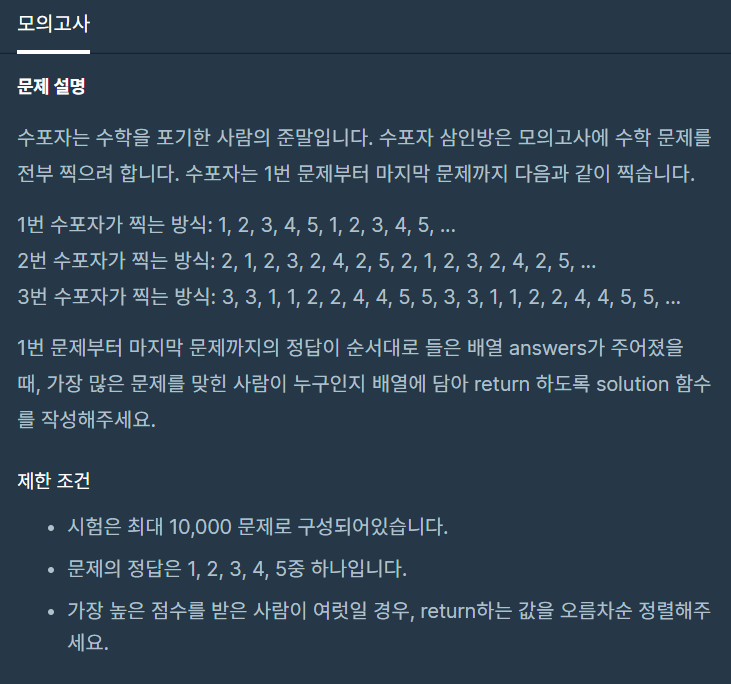
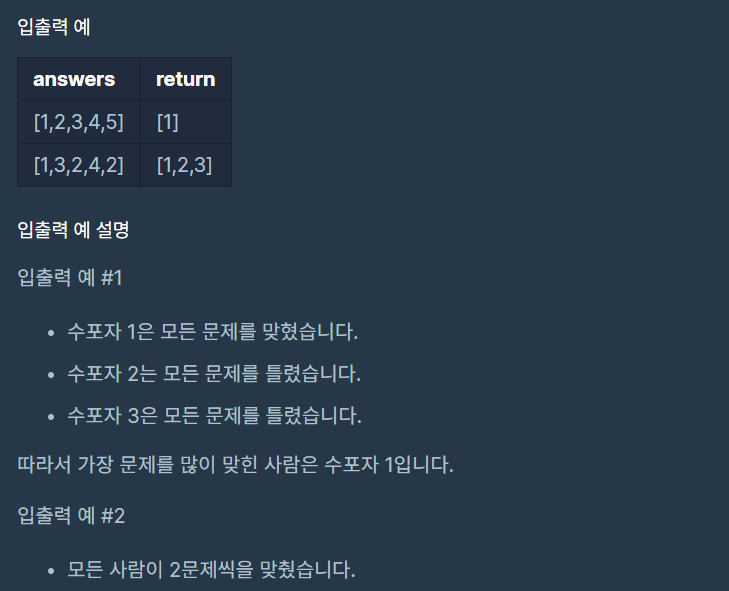

## 프로그래머스 해시 코딩 테스트 연습

이번에는 완전 탐색 관련 코딩 테스트 문제를 풀어보았다.
물론 여러 개발자들이 다양한 알고리즘을 통하여 문제를 해결했겠지만,
나의 방식으로 문제 풀이를 정리해보려 한다. 누군가에겐 조금이라도 도움이 되었으면 한다.

## 프로그래머스 > 완전 탐색 > 모의고사 Level 1 / JavaScript

해당 문제는 아래 URL을 통하여 접속할 수 있다.
<br />
https://programmers.co.kr/learn/courses/30/lessons/42840

### 문제 설명





먼저 문제는 간단합니다. 수포자(수학을 포기한 사람)을 예시로 1, 2, 3번 학생이 있다고 가정하고
각각 학생은 특정 규칙에 맞춰 답을 반복적으로 답을 찍는 한다고 합니다.  
1번 학생은 순서대로 1, 2, 3, 4, 5, 1, 2, 3, 4, 5 ... 이런 식으로 반복되는 걸 보니 1, 2, 3, 4, 5인 **5자리**를 반복적으로 정답으로 사용하고 2번 학생은 2, 1, 2, 3, 2, 4, 2, 5, 2, 1, 2, 3, 2, 4, 2, 5 .. 를 보니 2를 반복하고 2를 제외한 나머지를 다음 값으로 반복하여 2, 1, 2, 3, 2, 4, 2, 5 인 **8자리**를 반복적으로 정답으로 사용하는 거 같습니다.

마지막으로 3번 학생은 3, 3, 1, 1, 2, 2, 4, 4, 5, 5 각 5개의 숫자를 2번씩 사용하여 **10자리**의 숫자를 반복합니다.

따라서 answers 즉 정답이 [1, 2, 3, 4, 5, 6, 7, 8, 9, 10]인 길이가 10개인 배열일 경우 각각 학생의 반복으로 찍은 정답과 실제 정답의 개수를 파악하고 가장 높은 학생을 배열에 담아 return 해주면 됩니다.

단, 하나의 조건으로 명시되어있는 게 가장 높은 점수를 받은 학생이 여럿일 경우엔 **오름차순**을 해달라고 하네요.

### 문제 풀이

먼저 해당 문제는 각 반복적인 정답을 비교해 각각 학생의 정답 개수를 파악하는 게 우선입니다.  
따라서 저는 각각 학생의 반복하는 정답의 개수 즉 1번 학생은 1, 2, 3, 4, 5 인 5가지 숫자와 2번 학생은 2, 1, 2, 3, 2, 4, 2, 5 인 8가지 숫자 3번 학생은 3, 3, 1, 1, 2, 2, 4, 4, 5, 5인 10자리 숫자가 실제 정답인 answers 길이만큼 반복하여 정답을 체크해야 합니다.  
따라서 각 반복하는 정답을 answers의 개수만큼 파악해서 배열을 만들어볼까 생각했지만 효율적이지 못하다는 생각이 들어 각 반복되는 숫자와 answers를 나눠 나머지를 계산하여 정답을 배열로 만들어 순환하며 계산하였습니다.  
즉, 1번 학생의 경우 정답으로 찍는 반복되는 수가 아래와 같이 배열을 정답 길이만큼 순환하여 비교하도록 하였습니다.

```js
const oneMath = [1, 2, 3, 4, 5]

for (let i = 0; i < answers.length; i++) {
  if (answers[i] === oneMath[i % 5]) {
    // 숫자카운트
  }
}
```

따라서 각 학생의 번호와 정답의 개수를 체크한 배열을 만들고 아래와 같이 각 각 카운트를 진행하였습니다.

```js
let answer = [
  { name: 1, count: 0 },
  { name: 2, count: 0 },
  { name: 3, count: 0 },
]
const oneMath = [1, 2, 3, 4, 5]
const twoMath = [2, 1, 2, 3, 2, 4, 2, 5]
const threeMath = [3, 3, 1, 1, 2, 2, 4, 4, 5, 5]

for (let i = 0; i < answers.length; i++) {
  if (answers[i] === oneMath[i % 5]) {
    answer[0].count += 1
  }

  if (answers[i] === twoMath[i % 8]) {
    answer[1].count += 1
  }

  if (answers[i] === threeMath[i % 10]) {
    answer[2].count += 1
  }
}
```

이렇게 되면 answer 배열에 각 학생의 정답 카운트가 누적이 되었고 마지막으로 가장 높은 점수의 학생을 배열에 담아
return 하면 되는데 마지막 조건인 정답자가 여럿일 경우는 오름차순으로 정렬하여 달라고 했습니다.

따라서 1, 2, 3번 모두 정답일 경우 오름차순으로 정렬하여주면 됩니다. 저는 sort 함수를 사용해서
각 학생의 count를 비교하여 count로 내림차순 하고 만약 count 값이 같다면 name으로 오름차순 하여
학생의 이름이 오름차순이 되도록 하였습니다.

다음 filter 함수를 통하여 count가 가장 높은 값보다 작은 값들은
전부 제거하고 map 함수를 통하여 name만 배열로 생각하면 이미 배열 안에 값들은 정렬이 된 상태로
정답이 출력됩니다. 아래는 코드입니다.

```js
function solution(answers) {
  let answer = [
    { name: 1, count: 0 },
    { name: 2, count: 0 },
    { name: 3, count: 0 },
  ]
  const oneMath = [1, 2, 3, 4, 5]
  const twoMath = [2, 1, 2, 3, 2, 4, 2, 5]
  const threeMath = [3, 3, 1, 1, 2, 2, 4, 4, 5, 5]

  for (let i = 0; i < answers.length; i++) {
    if (answers[i] === oneMath[i % 5]) {
      answer[0].count += 1
    }

    if (answers[i] === twoMath[i % 8]) {
      answer[1].count += 1
    }

    if (answers[i] === threeMath[i % 10]) {
      answer[2].count += 1
    }
  }

  answer = answer
    .sort((a, b) => {
      let same = b.count - a.count
      return same === 0 ? a.name - b.name : same
    })
    .filter(item => answer[0].count <= item.count)
    .map(item => item.name)

  return answer
}
```
