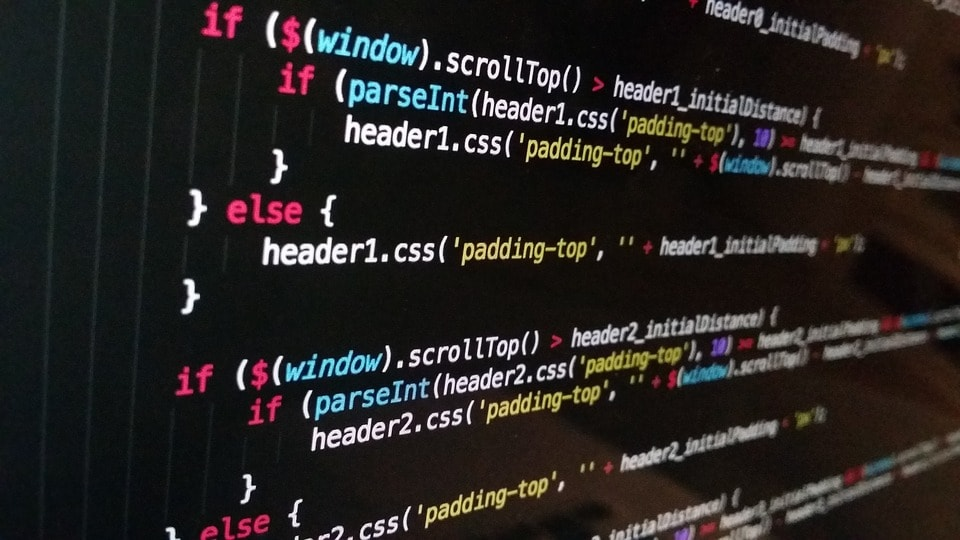

## 프로그래머스 해시 코딩 테스트 연습

예전부터 언젠가의 이직에 대한 생각도 있었고 여러 회사의 공고들을 보면서 요새 많은 회사들이 어떤
기술을 활용하는지와 개발 트렌드도 파악하는데 도움을 얻었다.
결론적으로는 막연하게 트렌드만 보기도 했고, 대부분의 개발회사가 코딩 테스트를 본다..
신기술에 대해서는 찾아보고 공부하는 부분도 있지만 실질적으로 중요한 부분은 로직을 어떻게
짜는지도 중요하다고 생각하기 때문에 다시 코딩 테스트를 통하여 지식을 탄탄하게 해야겠다는 생각과
언젠가의 이직에 대한 생각 때문에 코딩 테스트를 공부해야겠다는 생각이 들었다.

## 프로그래머스 > 해시 > 위장 문제 / JavaScript

해당 문제는 아래 URL을 통하여 접속할 수 있다.
<br />
https://programmers.co.kr/learn/challenges?selected_part_id=12077

### 문제 풀이


대강 문제는 각 headgear, eyerwear, face 등 큰 틀에 포함되는 각각 아이템들의 조합을 구해야 한다.
조합에 조건은 최소 한개 이상 의상을 입는다는 것으로 하나는 포함이 된다.
<br />
위 입출력예제 첫 번째 예시는 yellow_hat / blue_sunglasses / green_turban / yellow_hat, blue_sunglasses / green_turban, blue_sunglasses다.

<br />

따라서 테스트를 하면서 가장 먼저 생각한 부분은 각 headgear, eyerwear, face 큰 주제의 아이템이 몇 가지씩 존재하는지 먼저 뽑아내야 한다고 생각했다. 따라서 아래와 같이 작성하여 각 개수를 Object를 만들었다.
나는 javascript로 코딩 테스트를 진행하였다. 프로그러머스에선 여러 언어들로 테스트할 수 있으니 자신이 해보고 싶은
언어에 맞춰 테스트를 하면 된다.

아래와 같이 cloclothes이라는 배열을 받아 반복하며 각 주제의 갯수를 파악했다.

```js
for (var i = 0; i < clothes.length; i++) {
  if (Object.keys(temp).includes(clothes[i][1])) {
    temp[clothes[i][1]] = temp[clothes[i][1]] + 1
  } else {
    temp[clothes[i][1]] = 1
  }
}
```

그 후 문제는 조합의 개수인데 주사위 2개의 조합을 구하는 공식은 6x6 일 것이다. 하지만 이 조합은 2개를 모두 던진다는 가정이 들어간다. 조합을 생각하면서 조금 시간이 걸렸고 풀이를 위해 검색했다..다음에 이와 비슷한 문제를 해결하기 위해 이해가 필요했다.
결론적으론 최소 1개 이상의 조합이 나온다는 점을 생각하면 다른 headgear, eyerwear, face 중 2개는 사용 안해두 되기
때문에 아 주제의 개수에 포함을 하지 않을 경우를 위해 +1씩 해줘야 한다.

예를 들어 headgear, eyerwear, face 개수가 각각 3 2 2일 경우 +1씩 해준 4 3 3을 모두 곱해주면 각 주제가 포함되지 않을 조합까지 구하게 된다. 여기서 주의해야 할 점은 최소 1개 이상 포함이다.
따라서 각 주제의 객수를 곱한 후 각 주제가 전부 포함되지 않을 경우를 -1 해준다. 어느 정도 검색한 부분도 존재하여 만족하지 않지만 다음 테스트 때는 이런 유형의 문제를 잘 해결할 수 있을 것 같다.

총 문제 풀이는 아래와 같으며 프로그래머스에선 테스트를 모두 통과했다.

```js
function solution(clothes) {
  var answer = 1

  var temp = {}

  for (var i = 0; i < clothes.length; i++) {
    if (Object.keys(temp).includes(clothes[i][1])) {
      temp[clothes[i][1]] = temp[clothes[i][1]] + 1
    } else {
      temp[clothes[i][1]] = 1
    }
  }

  Object.values(temp).map(item => {
    answer = answer * (item + 1)
  })

  return answer - 1
}
```
