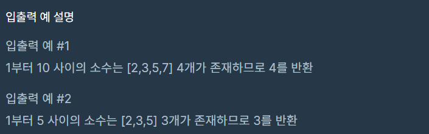

## 프로그래머스 소수 찾기 레벨 1

저번 코딩 테스트 공부에 이어 조금씩 발전해 나가기 위해서 소수찾기 코딩 테스트를 연습해 봤다.
이번에도 자바스크립트로 코딩 테스트를 진행하였고 역시나 만족하지 못하는 결과를 얻었지만, 조금 씩
풀다 보면 자연스레 발전할 것이라 믿는다.
<br />
해당 문제는 아래 URL을 통하여 접속할 수 있다.
<br />
https://programmers.co.kr/learn/courses/30/lessons/12921

### 문제 풀이

대강 문제는 n를 주어지고 n의 범위 중에 소수의 개수를 찾는 코딩테스트다. 문제는 아래와 같다.




문제풀이에는 다양한 방법이 존재하지만 기존에 스터디를 같이 진행하는 지인에게 에라토스테네스의 체에 대하여 알고 있었기 때문에
에라토스테네스의 체로 풀었다.
에라토스테네스의 체는 간단하게 말하면 1 ~ n까지의 수에서 n의 소수는 n의 제곱근까지의 배수를 모두 제외하면 n까지의 소수만 남게 된다.
예를 들어 1~100까지의 소수는 100은 10까지의 배수를 제외하면 된다. 따라서 2 3 5 7의 배수만 제외해주면 된다.
제곱근의 배수 제외 또한 전부 제외할 필요가 없다. 그 이유는 m = a \* b 일 때 a와 b 중 하나는 n의 제곱근에 포함되기 때문이다.
n의 제곱근 보다 작은 합성수 m은 작은 a 나 b의 배수로 체크된다.

풀이는 먼저 n까지 크기의 배열을 만들고 0과 1은 소수가 아니기 때문에 false로 값을 채워준다. 2부터 시작하여 i \* i <= 100 조건을 통해
제곱근까지의 배수만 제외할 수 있도록 했다.

다음 i의 값이 이미 소수의 배수들로 처리가 되어있는지 확인을 위해 arr[i] 조건을 줘 배수처리를 하지 않도록 한다.
다음은 j는 i \* i부터 시작해 소수는 true 처리가 되도록하고 j+=i를 통해 배수들을 모두 제외했다.

마지막으로 소수만 남은 배열에서 filter 함수를 통해 값이 true 조건으로 배열을 뽑아 갯수를 반환하였다.

```js
let solution = n => {
  // 0부터 시작임으로 배열의 크기를 1개 늘려준다.
  let arr = Array(n + 1)
    .fill(true)
    .fill(false, 0, 2)

  for (let i = 2; i * i <= n; i++) {
    if (arr[i]) {
      for (let j = i * i; j <= n; j += i) {
        arr[j] = false
      }
    }
  }

  return arr.filter(isPrime => isPrime).length
}
```

<br />
에라토스테네스의 체를 이용한 방법 이외에도 다른 개발자들의 코딩테스트 문제풀이를 보고 문제를 푸는 방법은
역시 많고 무궁무진 하다는 생각이 들었다. 꾸준히 테스트를 해보고 개선해 나가도록 하자.
