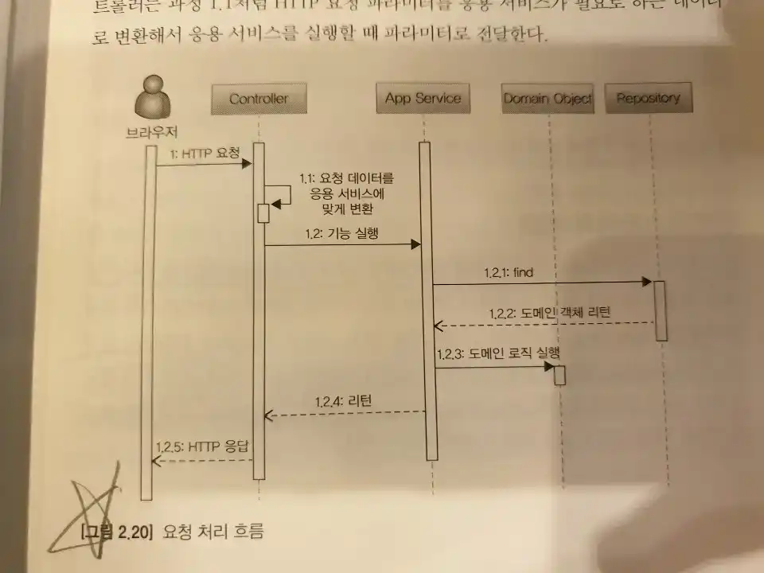

## 네 개의 영역
- 표현(UI)
  - 사용자의 요청을 받아 응용 영역에 전달하고 응용 영역의 처리결과를 다시 사용자에게 보여주는 역할을 한다.
  - 웹 에플리케이션 개발 시 사용하는 스프링 MVC 프레임워크도 표현 영역을 위한 기술에 해당된다.
  - 표현 영역의 사용자는 사람일 수도 있고, REST API를 호출하는 외부 시스템일 수도있다.
  - 표현 영역은 HTTP 요청을 응용 영역이 필요한 형태로 변환하여 전달하고 응용 영역의 응답을 다시 필요한 HTTP 형으로 만들어 웹 브라우저에게 리턴한다.

- 응용
  - 표현 영역을 통해 사용자의 요청을 전달받은 응용 영역은 사용자에게 제공할 기능을 구현한다.
  - 기능을 구현하기 위해 도메인 영역의 도메인 모델을 사용
  - 로직을 직접 수행하기보단, 도메인 모델에 구현된 로직을 호출 (로직 수행을 도메인 영역에 위임)
```java
public class CancleOrderService {
    @Transactional
    public void cancleOrder(String orderId) {
        Order order = findOrderById(orederId);
        if (order == null) throw new OrderNotFoundException(orderId);
        order.cancel();
    }
}
```
  - 위처럼 응용 서비스는 로직을 직접 수정하기보다 도메인 모델에 로직 수행을 위임한다.
  - Order라는 도메인에 cancle\(\)를 통하여 주문을 취소하고 있다.

- 도메인
  - 도메인 모델을 구현한다. (엔티티, 밸류 등)
  - 위에서 보았던 Order.class와 같은 도메인 모델을 구성한다.
  - 도메인의 핵심 로직을 구현한다.

- 인프라스트럭처
  - 구현 기술에 대한 것을 다룬다.
  - **위에 설명 했던 것처럼 도메인 영역, 응용 영역, 표현 영역은 구현 기술을 사용한 코드를 직접 만들지 않는다.** 
  - RDBMS 연동, 메시지 큐 연동, 메일 발송, 타 시스템 REST API 호출 등의 세부 구현을 다룬다.
  - 도메인의 논리적인 개념을 표현하기 보단 `실제 구현`을 다룬다.

표현, 응용, 도메인은 실제 구현 기술을 사용하는 코드를 작성하지 않고, 인프라스트럭처 영역에서 제공하는 기능을 사용한다.

## 계층 구조 아키텍처
일반적으로 표현 -> 응용 -> 도메인 -> 인프라스트럭처 순으로 각 계층은 이전 계층에 의존하지 않는다. 하지만 구현의 편리함을 위해 `응용 -> 도메인, 인프라스트럭쳐`, `도메인 -> 인프라스트럭처` 식으로 응용 영역이 인프라스트럭처 영역의 모듈에 의존하기도 한다.

### 응용 영역이 인프라스트럭처 영역에 의존할 때 생길수있는 문제점
예를 들어 할인 금액 계산 기능을 제공하는 응용 서비스가 있다고 해보자.
복잡한 할인 규칙 계산하기 쉽게 Drools라는 룰 엔진을 사용해 인프라스트럭처에 모듈로 구현하고, 응용 서비스에서 이를 사용한다. 이 말인 즉, **표현, 응용, 도메인 계층이 상세한 구현 기술을 다루는 인프라스트럭쳐에 의존할 수 있다는 점이다.**
예를 들면 아래처럼 될 수 있다.
Drools 룰 엔진 세부 구현 (인프라스트럭처)
```java
public class DroolsRuleEngine {
    private KieContainer kContainer;

    public DroolsRuleEngine {
        KieServices ks = KieServices.Factory.get();
        kContainer = ks.getKieClasspathContainer();
    }

    public void evalute(String sessionName, List<?> facts) {
        KieSession kSession = kContainer.newKieSession(sessionName);
        try {
            facts.forEach(x -> kSession.insert(x));
            kSession.fireAllrules();
        } finally {
            kSession.dispose();
        }
    }
}
```
할인 금액 계산 서비스 (응용)
```java
public class CalculateDiscountService {
    private DroolsRuleEngine ruleEngine;

    public CalculateDiscountService() {
        ruleEngine = new DroolsRuleEngine();
    }

    public Money calculateDiscount(List<OrderLine> orderLines, String customerId) {
        Customer customer = findCustomer(customerId);

        MutableMoney money = new MutableMoney(0);
        List<?> facts = Arrays.asList(customer, money); // Drools 특화코드 (세부 기술에 대한 지식)
        facts.addAll(orderLines); // Drools 특화코드 (세부 기술에 대한 지식)
        ruleEngine.evalute("discountCalculation", facts); // Drools 특화코드 (세부 기술에 대한 지식)
        return money.toImmutableMoney();
    }
}
```
위 코드에서 볼 수 있는 문제점은 다음과 같다.
> 1. 응용 계층의 로직만으로는 테스트가 불가능하다. 인프라스트럭처 모듈이 정상 작동 해야한다. 즉, roolsRuleEngine이 완벽하게 동작해야만 CalculateDiscountService를 테스트할 수 있다.
> 2. 구현 방식 변경과 기능 확장이 어려워 진다. 상위 계층인 인프라스트럭처 모듈을 수정하면 하위 응용 계층 로직도 수정해야한다.

고수준 모둘이 제대로 동작하려면 저수준 모듈을 사용해야 하는데, 인프라스트럭쳐의 경우 특정 기술을 직접 구현하므로 이러한 문제점이 발생하게 된다.
이를 어떻게 처리할 수 있을까?

## DIP
정답은 저수준 모델이 고수준 모델에 의존하도록 바꾸는 것이고 이를 DIP(Dependency Inversion Principle, 의존 역전 원칙) 이라고 한다.
다시 한번 CalculateDiscountService를 살펴보면, discount를 얻는데 어떤 엔진을 사용했느냐는 중요하지 않다.
단지, 고객정보와 구매정보에 룰을 적용해서 할인 금액을 구한다는 것이 중요할 뿐이다.
이 부분을 추상화해서 인터페이스로 만들 수 있다.
```java
public interface RuleDiscounter {
    public Money applyRules(Customer customer, List<OrderLine> orderLines);
}
```
이 인터페이스를 사용하여 CalculateDiscountService에서 DroolsRuleEngine을 제거할 수 있다.
```java
public class CalculateDiscountService {
    private RuleDiscounter ruleDiscounter;

    public CalculateDiscountService(RuleDiscounter ruleDiscounter) {
        this.ruleDiscounter = ruleDiscounter;
    }

    public Money calculateDiscount(List<OrderLine> orderLines, String customerId) {
        Customer customer = findCustomer(customerId);
        return ruleDiscounter.applyRules(customer, orderLines);
    }
}
```
Drools를 사용하는 RuleDiscounter 구현
```java
public class DroolsRuleDiscounter implements RuleDiscounter {
    @Override
    public Money applyRules(Customer customer, List<OrderLine> orderLines) {
        // 세부 구현
        ... 
    }
}
```
`CalculateDiscountService`는 더 이상 구현기술인 `Drools(저수준)`에 의존하지 않고,
`룰을 이용한 할인 금액 계산` 을 표현하는 `RuleDiscounter` 인터페이스(고수준)에 의존한다.
그리고 인터페이스를 구현한 저수준 모듈은 외부에서 생성해 주입(Dependency Injection) 해주게 된다.
이와 같이 DIP를 적용함으로써 기존의 고수준 모듈에서 저수준 모듈 사용에서 오던 문제점들을 해결할 수 있게 된다.

#### DIP 주의사항
- 단순히 인터페이스와 구현 클래스를 분리하는 것이 DIP가 아니다.
- 핵심은 고수준 모듈이 저수준 모듈에 의존하지 않도록 하는것이다.
- 올바른 DIP를 위해 인터페이스 도출 시 **도메인 관점(고수준)**으로 바라보는 것이 중요하다.


## 도메인 영역의 주요 구성요소
- 엔티티 (ENTITY)
  - 고유의 식별자를 가지고 자신의 라이프 사이클을 갖는 객체
  - 도메인의 고유한 개념을 표현. 데이터와 관련 기능을 제공한다. 
- 밸류 (VALUE)
  - 고유의 식별자를 갖지 않고 주로 엔티티의 속성을 표현할 때 사용되는 객체
  - 다른 밸류 타입의 속성으로도 사용될 수 있다.
- 애그리거트 (AGGREGATE)
  - 여러 엔티티와 밸류 객체를 개념적으로 하나로 묶은 것. 예를들어 `주문` 도메인은 주문 엔티티, 주문 항목 엔티티, 주문자 엔티티를 `주문` 애그리거트로 묶을수있다.
- 리포지터리 (REPOSITORY)
  - 도메인 모델의 영속성을 처리. 대표적으로 DBMS에 저장, 조회하는 역할을 담당 
- 도메인 서비스 (DOMAIN SERVICE)
  - 특정 엔티티에 속하지 않은 도메인 로직을 제공. 예를들어 `할인 금액 계산` 기능은 상품, 쿠폰, 회원 등급 구매 금액 등 여러 엔티티와 밸류를 필요로 하는데 이럴 때 도메인 서비스를 통해 기능을 구현.

### 엔티티와 밸류
도메인 모델의 엔티티와 DB 모델의 엔티티는 차이점이 있다.
- DB 엔티티가 해당 개념의 데이터만 표현하는 반면 도메인 모델의 엔티티는 데이터 뿐만 아니라 ***도메인 기능을 함께 제공한다.***
- DB 엔티티는 속성을 컬럼으로 밖에 표현할 수 없는데 도메인 모델의 엔티티는 밸류 타입을 사용할 수 있다.
  - 물론 DB에서도 관련 데이터를 묶어 별도 테이블로 분리할 수 있지만, 밸류 타입의 의미가 드러나지 않음
  - 밸류 타입에서 `변경`이란 밸류 객체 자체를 교체하는건데, 테이블 분리라면 값 변경일 뿐이고 이는 밸튜 타입 구현에 권장되는 방법인 `불변`에 위배됨

##### 데이터베이스 엔티티
> 데이타베이스 분야에서 개체 또는 엔티티(Entity)라고 하는 것은 데이타베이스에 표현하려고 하는 유형, 무형의 객체로서 서로 구별되는 것을 뜻한다. 이 개체는 현실 세계에 대해 사람이 생각하는 개념이나 정보의 단위로서 의미를 가지고 있다. 이것은 컴퓨터가 취급하는 화일의 레코드(record)에 대응한다. 이 개체는 그 단독으로 존재할 수 있으며, 정보로서의 역할을 한다. 하나의 개체는 하나 이상의 속성, 즉 애트리뷰트(attribute)로 구성되고 각 속성은 그 개체의 특성이나 상태를 기술해 준다.

### 애그리거트
도메인이 커질수록 개발할 도메인 모델도 커지게 되고, 많은 엔티티와 벨류가 생기면서 모델이 점점 더 복잡해진다. 이렇게 도메인 모델이 복잡해지면 개발자가 전체 구조가 아닌 한개 엔티티와 벨류에 집중하게 되는 경우가 발생한다.

지도를 볼 때 매우 상세하게 나온 대축적 지도를 보면 큰 수준에서 어디에 위치하고 있는지 이해하기 어려우므로 큰 수준에서 보여주는 소축적 지도를 함꼐 봐야 현재 위치를 보다 더 정확하게 이해할 수 있다.
이와 비슷하게 도메인 모델도 개별 객체가 아니라 상위 수준에서 모델을 볼 수 있어야 전체 모델과 개별 모델을 이해하는데 도움이 된다.
이게 바로 애그리거트(AGGREGATE) 이다.
- 애그리거트는 관련 객체를 하나로 묶어 도메인 모델을 상위 수준에서 이해하는 것을 돕는다.
  - `주문` 애그리거트는 `주문`,`주문자`,`배송정보` 등을 포함한다.
- 애그리거트는 해당 군집에 속한 객체들을 관리하는 루트 엔티티를 갖는다. (애그리거트 루트)
  - 루트 엔티티에서 해당 애그리거트에 속해 있는 엔티티와 밸류 객체를 이용해 애그리거트가 구현해야할 도메인의 기능을 제공 (캡슐화)
  - 애그리거트 사용 측에서는 애그리거트 루트를 통해서만 해당 애그리커트 내 다른 밸류 객체에 접근 (책 60P)

> OOP에서 객체의 캡슐화와 애그리거트를 대조해 생각해보면 좀 더 이해가 쉽다.
>* 객체의 필드(속성), 메소드를 하나로 묶고, 실제 구현 내용을 외부에 감추는 것을 말한다. => 애그리거트 루트이외 하위 엔티티 및 밸류는 노출하지 않음
>* 외부 객체는 객체 내부의 구조를 얻지 못하며 객체가 노출해서 제공하는 필드와 메소드만 이용할 수 있다. => 애그리거트 루트를 통해서만 도메인 기능 호출 가능
>* 필드와 메소드를 캡슐화하여 보호하는 이유는 외부의 잘못된 사용으로 인해 객체가 손상되지 않도록 하는데 있다. => 애그리거트에 대한 조작을 의도한 방법만으로만 가능하게 함

### 리포지터리
도메인 모델을 지속적으로 사용하려면 RDBMS, NoSQL, 파일 등 물리적 저장소에 저장(영속화)해야한다. 이를 위한 도메인 모델이 리포지터리이다. 
- 리포지토리는 애그리거트 단위로 도메인 객체를 조회하고 저장하는 기능을 제공한다.
- 리포지터리는 도메인 객체를 영속화하는데 필요한 기능을 추상화 한 것이기 떄문에 고수준 모듈에 속하고, 실제 구현 클래스는 인프라스트럭쳐 영역에 속한다.

- 엔티티와 밸류가 요구사항에서 도출되는 모델이라면, 리포지터리는 구현단계에서 도출되는 모델
- 주문 애그리거트를 위한 리포지터리 예시

```java
public inferface OrderRepository {
    public Order findByNumber(OrderNumber number);
    public void save(Order order);
    public void delete(Order order);
}
```
- 위 예시에서 리포지터리에서 조작하는 도메인 모델의 단위가 주문 애그리거트 루트인 주문(Order)이다.
- 결과적으로 주문 엔티티는 주문 애그리거트에 속한 하위 도메인 모델들을 전부 포함하고 있기 때문에 주문 애그리거트 단위 처리가 된다.
- 주문 취소 기능을 제공하는 응용 서비스 예시

```java
public class CancelOrderService {
    private OrderRepository orderRepository;

    public void cancel(OrderNumber number) {
        // 리포지터리를 통해 도메인 객체 조회
        Order order = orderRepository.findByNumber(number);
        if (order == null) throw new NoOrderException(number);

        // 도메인 객체에 구현된 취소 기능 실행
        order.cancel();
    }
}
```
- 도메인 모델 관점에서 OrderRepository는 도메인 객체를 영속화 하는데 필요한 기능을 interface로 추상화한 것으로 고수준 모듈에 속함 (책 63p)
- 실제로 JPA 등으로 OrderRepositofy를 구현(implement)하는 클래스는 저수준 모듈로 인프라 영역에 속한다.
- 스프링 프레임워크를 사용한다면 아래와 같이 응용 서비스를 구성할 수 있다.

```java 
@Configuration
public class OrderServiceConfig {
    @Autowired
    private OrderRepository orderRepository;

    @Bean
    public CancelOrderService cancelOrderService() {
        return new CancelOrderService(orderRepository);
    }
}
```
```java
@Configuration
public class RepositoryConfig {
    @Bean
    public JpaOrderRepository orderRepository() {
        return new JpaOrderRepository();
    }

    @Bean
    public LocalContainerEntityManagerFactoryBean emf() {
        ...
    }
}
```
- 응용 서비스와 리포지터리는 다음과 같은 이유로 밀접한 연관이 있다.
  - 응용 서비스는 필요한 도메인 객체를 구하거나 저장하기 위해 리포지터리를 사용
  - 응용 서비스는 트랜잭션을 관리하는데, 트랜잭션 처리는 리포지터리 구현 기술에 영향을 받음
- 리포지터리의 사용 주체가 응용 서비스이기 때문에 리포지터리는 응용 서비스가 필요로 하는 메서드를 제공
  - 애그리거트를 저장하는 메서드 `void save(Aggregate agg)`
  - 애그리거트를 저장하는 메서드 `Aggregate findById(SomeId id)`
  - 필요에 따라 `delete`, `counts` 등 추가 기능 제공

## 요청 처리 흐름

1. 사용자가 애플리케이션에 기능 실행 요청을 표현 영역에서 받는다.
2. 사용자의 요청을 검사하고 응용 서비스가 요구하는 형식으로 변환하여 응용 영역으로 전달한다.
3. 기능 구현에 필요한 도메인 객체를 Repository에서 가져와 도메인 로직을 실행하거나 신규 도메인 객체를 생성해서 Repository에 저장한다.
    - 도메인 객체를 사용해서 사용자의 요청을 처리
    - 트랜잭션 관리 및 처리 ex) 회원가입 성공 시, 회원 정보를 DB에 반영해야함.
    - @Transactional
4. 실행 결과를 사용자에게 리턴한다.

## 인프라스트럭처 개요
표현, 응용, 도메인 영역을 지원하는 영역이다.
  - 인프라스트럭처를 직접 사용하는 것보다 각자의 영역에서 정의한 인터페이스를 인프라스트럭처 영역에서 구현하는 것이 좋다.
    - 교체와 테스트의 어려움을 해결할 수 있다.
  - 무조건 인프라스트럭처에 대한 의존을 없애는 것이 좋은 것은 아니다. 
    - @Transactional을 사용하는 것이 편리하다.
  - 의존을 완전히 갖지 않도록 시도하는 것은 구현을 더 복잡하고 어렵게 만들 수 있다.
따라서, DIP의 장점을 해치지 않는 범위에서 응용 영역과 도메인 영역에서 구현 기술에 대한 의존을 가져가는 것이 현명하다.

## 모듈 구성
- 한 패키지에 가능하면 10개 미만으로 타입 개수를 유지하려고 노력한다.
- 이 개수가 넘어가면 모듈을 분리하여 시도해 본다.

### 참조
> [최범균,『DDD Start!』, 지앤선(2016)](https://www.aladin.co.kr/shop/wproduct.aspx?ItemId=84000742)