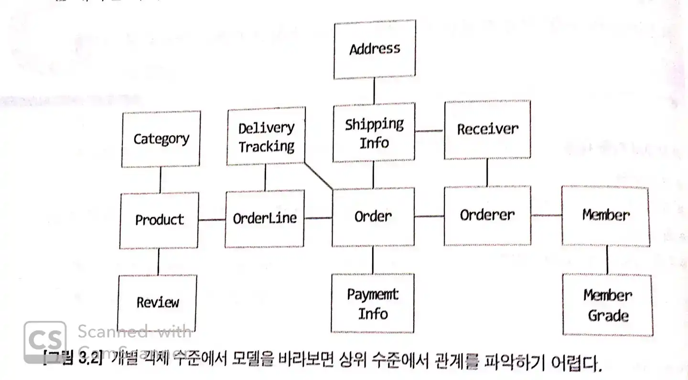
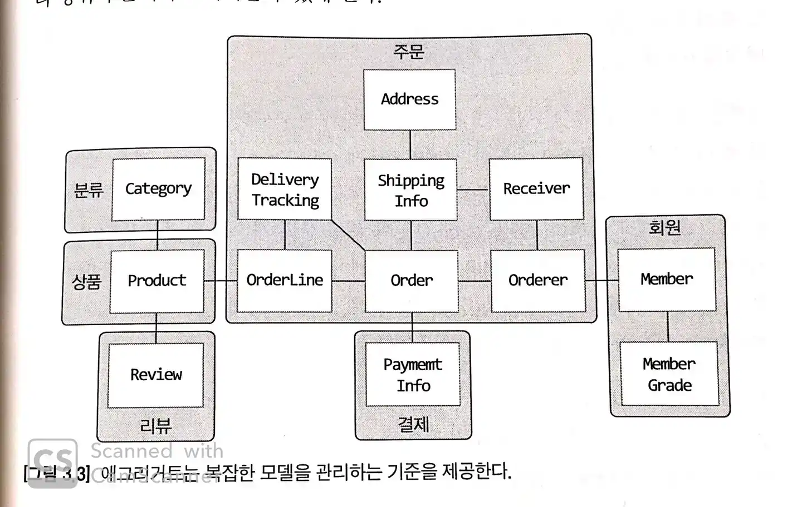
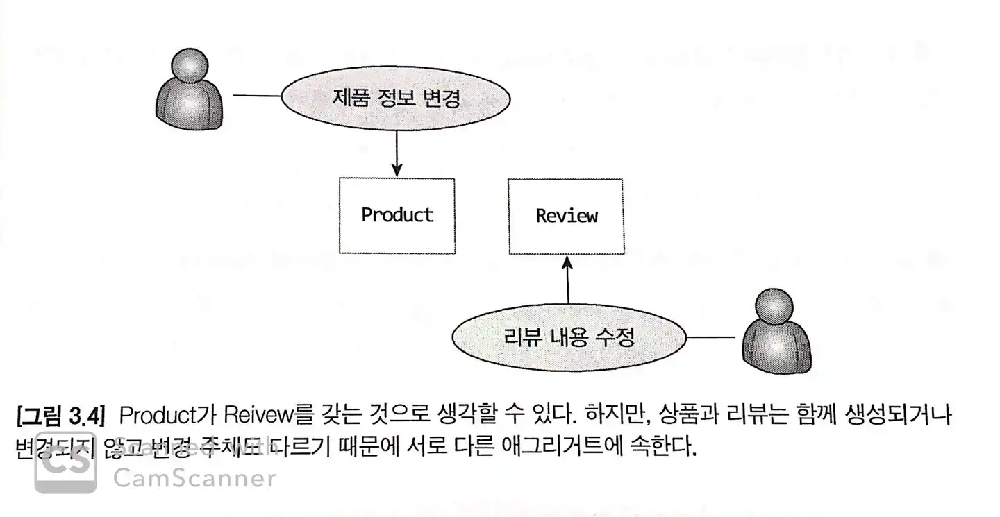

#### ※DDD Start! 책이 있다는 가정하에 정리한 포스팅입니다.

## 애그리거트

- 애그러거트는 관련된 객체를 하나의 군으로 묶어준다.
- 수 많은 객체를 애그리거트로 묶어서 바라보면 좀 더 상위 수준에서 도메인 모델 간의 관계를 파악할 수있다.
- 73p 그림3.3을 보면 복잡했던 그림3.2를 애그리거트로 묶음으로 인하여 모델 간의 관계를 개별 모델 수준과 함께 상위 수준에서도 이해할 수 있게 된다.

      

- 애그리거트는 모델을 이해하는데 도움을 줄 뿐만 아니라 일관성을 관리하는 기준이 된다.
- 애그리거트의 객체들은 유사하거나 동일한 라이프사이클을 가지게 된다.
  - 따라서 애그리거트에 속한 구성요소는 대부분 함께 생성하고 함께 제거한다.
  - 한 애그리거트에 속한 객체는 다른 애그리거트에 속하지 않는다.
- 애그리거트는 독립된 객체군이며, 각 애그리거트는 자기 자신을 관리할 뿐 다른 애그리거트를 관리하지 않는다.
- 경계를 설정할 때 기본이 되는 것은 도메인 규칙과 요구사항이다.

  - 도메인 규칙에 따라 함께 생성되는 구성요소는 한 애그리거트에 속할 가능성이 높다.
  - 함께 변경되는 빈도가 높은 객체는 한 애그리거트에 속할 가능성이 높다.
  - 예외사항 - 75p 그림3.4와 같이 삼품과 리뷰가 같이 표출되어야 한다는 요구사항이 존재 할 경우 상품과 리뷰는 같은 애그리거트로 이해 할 수 있지만, 상품과 리뷰는 함께 생성되지 않을 뿐더라 변경 주체도 다르기 때문에 서로 다른 애그리거트에 속한다.
  - 따라서 예상보다 하나의 엔티티 객체를 갖는 애그리거트가 많으며, 두 개 이상의 엔티티로 구성 되는 애그리거트는 예상보다 많지 않다.

   

## 애그리거트 루트

애그리거트를 대표하는 엔티티 객체를 `루트 엔티티`라고 한다. 
- 애그리거트에 속한 객체는 애그리거트 루트 엔티티에 직접 또는 간접적으로 속한다.
- 애그리거트는 여러 객체로 구성되기 때문에 특정 객체만 상태가 정상이어서는 안 된다. 도메인의 규칙과 요구사항을 충실하게 지키기 위해서는 애그리거트에 속한 모든 객체가 정상 상태를 가져야 한다. 이러한 **일관된 상태**를 유지하기 위해 관리할 객체가 필요하다. 이것이 `애그리거트 루트`이다.
- 일관성을 유지해야 하기 떄문에 애그리거트 루트는 연관 객체들의 상태에 제어권을 가지게 되며 도메인 기능 구현을 담당한다.
- 애그리거트 루트가 아닌 다른 객체에서 애그리거트에 속한 객체에 직접적인 접근을 못하도록 해야한다.
- 애그리거트 루트를 통해서만 간접적으로 다른 객체에 접근하기 때문에, 이는 애그리거트의 내부 구현을 숨겨서 애그리거트 단위로 구현을 `캡슐화`할 수 있도록 돕는다.

```java
// 주문 상태, 규칙을 무시하고 주소를 바꾸고 있다.
ShippingInfo si = order.getShippingInfo();
si.setAddress(newAddress);
```
> 이는 도메인 규칙을 무시하고 DB테이블에서 직접 데이터를 수정하는 것과 같다. 즉, 애그리거트 루트가 강제하는 규칙을 적용할 수 없어 모델의 일관성을 꺠는 원인이 된다. 
그렇다고 이를 막는 상태확인 로직(배송상태 확인)을 응용 서비스에 구현하게 되면, 해당 로직이 여러 응용 서비스에서 중복해서 구현할 가능성이 높아진다.

따라서, 가급적이면 응집성 있게 도메인 클래스에서 구현을 담당하도록 해야 한다. 이를 지키기 위해서는 `setter 메서드 사용 지양` 그리고 벨류 타입에 대한 `불변 클래스 적극적 활용`하는 방법을 습관화 시켜야 한다.
> setter 메서드를 외부에서 접근하게 되면, 엔티티의 상태 변화 제어가 어려워진다. 다시 말해, 상태 변경에 대하여 왜/어떻게 변했는지에 대한 추적이 어려워진다.
실제 초기 단계에서는 도메인에 대한 구현이나 요구사항이 복잡하지 않아 생기는 문제가 적겠지만, 추후 도메인과 비즈니스가 확장됨에 따라 변경이 발생하고 코드 베이스가 길어지면 관리하기 힘들어 지는 것이 자명한 사실이다. 코드 베이스가 길어지면 어쩔 수 없는 일이라고 생각하는 사람도 있겠지만 길어지더라도 변경에 대한 이유와 근거가 명확한 것이 추후 유지보수성이나 확장에 유리하다고 생각한다. e.g. changeShippingInfo()가 배송지 정보를 새로 변경한다는 의미를 가졌다면 setShippingInfo() 메서드는 단순히 배송지 값을 설정한다는 것을 뜻한다. completePayment() <-> setOrderState()
이러한 차원에서 가급적이면 setter 사용을 지양하고 도메인 클래스 혹은 도메인 서비스에서 상태 변경을 제어하도록 하여 일관성 있는 구현을 유지하는 것이 중요하다고 할 수 있다.

```java
public class Order{
    private ShippingInfo shippingInfo;
    public void changeShippingInfo(ShippingInfo newShippingInfo){
        verifyNotYetShipped();
        setShippingInfo(newShippingInfo);
    }
    private void setShippingInfo(ShippingInfo newShippingInfo){
        this.shippingInfo = newShippingInfo;
    }
}
```
> 위의 코드와 같이 밸류 타입의 내부 상태를 변경하려면 `새로운 밸류 객체를 할당`하는 것뿐이다. **즉, 애그리거트 루트를 통해서만 가능한다.** 그러므로, 애그리거트 루트가 도메인 규칙을 올바르게만 구현하면 애그리거트 전체의 일관성을 올바르게 유지할 수 있다.

### 애그리거트 루트의 기능 구현
- 애그리거트 루트는 다른 객체들을 조합해서 기능을 완성한다.
> Order는 총 주문 금액을 구하기 위해 OrderLine 목록을 사용한다.

```java
public class Order{
    private Money totalAmounts;
    private List<OrderLine> orderLines;

    private void calculateTotalAmounts(){
        int sum = orderLines.stream()
                .mapToInt(o1 -> o1.getPrice() * o1.quantity())
                .sum();
        this.totaAmounts = new Money(sum);
    }
}
```

- 기능 실행을 위임하기도 한다.

```java
class Order {
    private OrderLines orderLines;
    private Long totalAmounts;

    public void changeOrderLines(List<OrderLine> newOrderLines) {
        orderLines.changeOrderLines(newOrderLines); // delegate
        this.totalAmounts = orderLines.getTotalAmounts();
    }
}
class OrderLines {
    private List<OrderLine> orderLines;

    public Money getTotalAmounts() { ......; } 
    public void changeOrderLines(List<OrderLine> newOrderLines) {
        this.orderLines = newOrderLines;
    }
}
```

### 트랜잭션 범위
- 트랜잭션의 범위는 작을수록 좋다. 따라서 가급적이면 **애그리거트 단위로 트랜잭션을 제한하는 것이 좋다.**
  - 한 트랜잭션에서 두 개 이상의 애그리거트를 수정하게 된다면?
  > 트랜잭션 충돌이 발생할 가능성이 높아 진다. 결국, 전체 처리량이 떨어지게 된다.
  > 애그리거트간의 의존이 생기기 시작하면 결국 결합도가 높아지게 되고 이는 곧 수정 비용이 증가하된다. 따라서 가급적이면 트랜잭션의 범위는 하나의 애그리거트로 제한하는 것이 좋다.
- 만약, 한 트랜잭션에서 여러 애그리거트를 수정해야 하는 상황이 생긴다면 애그리거트에서 다른 애그리거트를 직접 수정하지 말고 **응용 서비스에서 두 애그리거트를 수정하도록 구현해야한다.**

```java
public class ChangeOrderService{
    @Transactional
    public void changeShippingInfo(OrderId id, ShippingInfo newShippingInfo, 
                                boolean useNewShippingAddr){
        .............
    }
}
```
  - `도메인 이벤트`를 구현하는 방법을 고려해보는 것이 좋다. 도메인 이벤트 구현을 사용하면 애그리거트간의 트랜잭션을 분리할수도 있으며 또한 구현 자체를 나눠서 할 수 있기 떄문에 코드에 대한 복잡성 역시 낮아지게 된다.

## 애그리거트와 리포지터리

- 애그리거트는 개념상 완전한 한 개의 도메인 모델을 표현하므로 객체의 영속성을 처리하는 리포지터리는 애그리거트 단위로 존재한다.
- 예를들어 Order가 애그리거트 루트이고 OrderLine인 애그리거트에 속하는 구성요소로 Order를 위한 리포지터리만 존재한다.
- 애거리거트를 영속화하고 애그리거트를 사용하려면 저장소에서 애그리거트를 읽어야 하므로 리포지터리는 적어도 다음의 두 메서드를 제공해야한다.
  - save - 애그리거트 저장
  - findById - ID로 애그리거트를 구함
- 애그리거트는 개념적으로 하나이므로 리포지터리는 애그리거트 전체를 저장소에 영속화 해야한다.

```java
// 리포지터리에 애그리거트를 저장하면 애그리거트 전체를 영속화해야 한다.
orderRepository.save(order);

// 리포지터리는 완전한 order를 제공해야 한다.
Order order = orderRepository.findById(orderId);
```

- 리포지터리가 완전한 애그리거트를 제공하지 않으면 필드나 값이 올바르지 않아 애그리거트의 기능을 실행하는 도중에 NullPointerException과 같은 이슈가 발생한다.
- RDMS를 이용해서 리포지터리를 구현하면 트랜잭션을 이용하여 애그리거트의 변경이 저장소에 반영하는 것을 보장할수 있고 NoSQL를 사용할 경우 애그리거트를 한 개 문서에 저장함으로써 보장 할 수 있다.


## ID를 이용한 애그리거트 참조

- 한 객체가 다른 객체를 참조하듯 애그리거트도 다른 애그리거트를 참조한다.
  - 애그리거트 루트에서 다른 애그리거트 루트를 참조
- 애그리거트 간 참조는 필드를 통해 쉽게 구현 가능
- JPA를 사용하면 @ManyToOne, @OneToMany 등 어노테이션을 활용해 매핑된 객체를 쉽게 로딩할 수 있다.
- ORM 기술 덕에 다른 애그리거트 루트에 대한 참조를 쉽게 구하고, 필드를 이용해 쉽게 접근 및 사용하면 편리하겠지만 다음과 같은 문제점이 있다
  - 편한 탐색 오용
  - 성능에 대한 고민
  - 확장의 어려움

### 편한 탐색 오용
- 애그리거트 직접 참조 시 발생할 수 있는 가장 큰 문제점
- 한 애그리거트 루트에서 타 애그리거트 루트를 접근 할 수 있으면, 상태 또한 쉽게 변경 가능
  - 트랜잭션 범위에서 말하는 것 처럼, 기본적으로 애그리거트 관리 범위는 자기 자신으로 한정해야한다.
  - 애그리거트 간 의존, 결합도가 높아짐

### 성능에 대한 고민 필요
- JPA를 사용할 경우 참조되는 객체를 LAZY, EAGER 방식으로 로드할 수 있다.
- 연관된 데이터를 한 화면에 보여주기 위한 조회 기능의 경우 필요한 정보를 한번에 조회하는 EAGER 방식이 유리
- 상태를 변경하는 기능의 경우 불필요한 데이터는 조회하지 않는 LAZY 방식이 유리
- 상황에 따라 고민하여 신중히 적용해야함

### 확장
- 단일 DB를 사용하면 크게 문제라 할 것 없다.
- 하지만 서비스가 커져 도메인별로 시스템을 분리하는 등 확장하게 될 경우, 도메인 별로 별도 DBMS를 사용할 가능성이 높다.
  - 심지어 특정 도메인은 RDB, 다른 도메인은 NoSQL 등 JPA 기술의 한계를 넘어서는 경우가 발생하게되면 단일 기술로는 불가능하게 됨

### 해결법
- 애그리거트를 직접 참조하지 않고 ID를 이용해 참조하도록 구현한다.
- 다른 애그리거트를 직접 참조하지 않기 때문에 결합도가 낮아짐
- 다른 애그리거트를 직접 참조하지 않기 때문에 로딩 방식 (LAZY, EAGER)등을 고민할 필요가 없어진다.
  - 필요하면 응용 서비스에서 ID를 통해 조회하면 된다.
  - 이는 애그리거트 수준에서 LAZY 로딩을 하는 것과 동일한 결과
- 다른 애그리거트를 직접 참조하지 않기 때문에 애그리거트 내에서 다른 애그리거트의 상태를 변경할 가능성이 원천적으로 차단됨.
- 애그리거트간 직접 참조가 존재하지 않기 때문에 애그리거트 별로 다른 구현 기술을 적용하기 용이하다

### ID를 이용한 참조 조회 성능
- ID를 이용해 참조할 경우 EAGER 조회가 필요한 경우에 문제가 발생할 수 있다. (N+1 문제)
- 이런 경우 별도 모델을 만들고 JPQL, QueryDSL 등으로 조인을 통해 한번에 조회한 후 해당 모델에 프로젝션하는 식으로 한번에 조회하면 된다.
- JPA를 사용한다해서 반드시 객체 참조를 통해 모든것을 처리하지 않아도 된다.
  - 오히려 이는 실용적이지 않을 수 있다.
  - ID 참조로 구현하고, 위에서 말한 방법 등으로 한번에 조회한다.
- 애그리거트마다 서로 다른 저장소를 사용하는 경우엔, 한 쿼리로 조회하는 것은 불가능하다.
  - 이 경우에 캐시를 적용하거나, 조회 전용 저장소를 따로 구현
  - 코드가 복잡해질수는 있지만, 시스템 처리량을 높일수 있음

## 애그리거트 간 집합 연관

- 애그리거트 간 1:N, N:1 관계가 있을수있다.
- 1:N 관계는 Set, List 등 컬렉션으로 표현 가능
- 만약 특정 카테고리에 있는 상품을 보여주는 기능을 구현한다고 하자

```java
public class Category {
    private Set<Product> products;  // 1:N 객체 직접 참조
}
```
- 위처럼 구현한 후 Category 조회 -> Product 조회 순으로 작업하게 되면 테이블의 모든 Product를 조회하게됨
  - 심각한 문제가 발생할 수 있음
- 때문에 이런 경우엔 연관을 반대의 경우로 적용할 수 있다.

```java
public class Product {
    private CategoryId categoryId;  // N:1 ID를 통한 참조
}
```
- 위와 같이 구현한 후 응용 서비스를 통해 필요 기능 구현

```java
public class ProductListService {
    public List<Product> getProductOfCategory(CategoryId id) {
        Category category = categoryRepository.findById(id);
        checkCategory(category);
        List<Product> products = productRepository.findByCategoryId(category.getId());
        return products;
    }
}
```

## 애그리거트를 팩토리로 사용하기
- 중요 도메인 로직 처리를 응용 영역에 노출되지 않아야한다.
- "상점이 제제상태이면 상품을 등록할 수 없다"라는 핵심 기능을 아래와 같이 구현했다고 하자.

```java
public class RegisterProductService {
    public ProductId registerNewProduct(NewProductRequest req) {
        Store account = accountRepository.findStoreById(req.getStoreId());
        if (account.isBlock()) throw new StoreBlockedException();   
        Product product = new Product(...);
        productRepository.save(product);
        return product.getId();
    }
}
```
- 위 코드는 언뜻 보면 큰 문제 없어보이는 코드이지만, 하나의 도메인 핵심 규칙이 응용 서비스에 노출되어있는 것이다.
- 이를 도메인 영역에서 처리하기 위해서는, 별도의 도메인 서비스를 만들거나, 별도의 팩토리 클래스를 만들수 있다.
- 하지만 다음과 같이 애그리거트에 팩토리 메소드 구현할 수도 있다.

```java
public class Store {
    // 도메인 핵심 기능을 구현하는 팩토리 메소드
    public Product createProduct(...) {
        if (isBlocked()) throw new StoreBlockedException();
        return new Product(...);
    }
}
```  
```java
public class RegisterProductService {
    public ProductId registerNewProduct(NewProductRequest req) {
        Store account = accountRepository.findStoreById(req.getStoreId());
        Product product = account.createProduct(...);
        productRepository.save(product);
        return product.getId();
    }
}
```
- 위처럼 변경하면 더 이상 응용 서비스 영역에서 Store의 상태를 확인하는 도메인 로직을 몰라도 된다.
- 만약 Product 생성 가능 여부에 대한 도메인 핵심 규칙이 변경되더라도 Store, 즉 도메인 영역만 변경하면 되며 응용 서비스 영역은 영향받지 않는다.
- 애그리거트가 갖고 있는 데이터를 이용해 다른 애그리거트를 생성해야하는 경우 팩토리 메소드를 고려하자

### 참조
> [최범균,『DDD Start!』, 지앤선(2016)](https://www.aladin.co.kr/shop/wproduct.aspx?ItemId=84000742)
