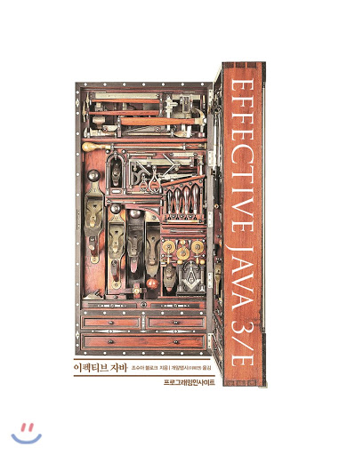

## try-finally보다는 try-with-resoureces를 사용하라.

### 기본적인 try-finally 사용

- 자바 라이브러리에는 close 메서드를 호출해 직접 닫아줘야하는 자원이 많다. InputStream, OutputSteam, java.sql.Connection 등이 좋은 예다.
- 자원 닫기는 클라이언트가 놓치기 쉬워서 성능 문제로 이어지기도 한다. 이런 자원 중 상당수가 안전망으로 finallizer를 활용하지만 finallizer은 믿을만하지 못하다.
- 전통적으로 자원이 제대로 닫힘을 보장하는 수단으로 try-finally가 쓰였다. 예외가 발생하거나 메서드에서 반환되는 경우를 포함해서다. 아래 예시를 보자.

```java
static String firstLineOfFile(String path) throws IOException {
    BufferedReader br = new BufferedReader(new FileReader(path));
    try {
        return br.readLine();
    } finally {
        br.close();
    }
}
```

위처럼 사용해도 무방하지만 자원을 하나더 사용하면 어떨까?

```java
static void copy(String src, String dst) throws IOException {
    InputStream in = new FileInputStream(src);
    try {
        OutputStream out = new FileOutputStream(dst);
        try {
            byte[] buf = new byte[BUFFER_SIZE];
            int n;
            while ((n = in.read(buf)) >= 0)
                out.write(buf, 0, n);
        } finally {
            out.close();
        }
    } finally {
        in.close();
    }
}
```

- 앞서 두개의 코드를 작성했을때 미묘한 결점이 있다. 예외는 try 블록과 finally 블록 모두에서 발생할 수 있는데, 예컨데 기기에 물리적인 문제가 생긴다면 firstLineOfFile 메서드 안의 readLine 메서드가 예외를 던지고, 같은 이유로 close 메서드도 실패할 것이다.
- 이렇게 되면 두번 째 예외가 첫 번째 예외를 완전히 집어삼켜 버린다. 따라서 첫 번째 예외에 관한 정보는 남지 않게 되어, 실제 시스템에서의 디버깅을 몹시 어렵게 한다.

### try-with-resources 사용

- 위에 구조들의 문제점을 try--with-resources를 사용하면 모두 해결할 수 있다.
- 이 구조를 사용하려면 해당 자원이 AutoCloseable 인터페이스를 구현해야한다. 단순히 void를 반환하는 close 메서드 하나만 덩그러니 정의한 인터페이스다.
- 위 소스에선 InputStream, OutputStream이 이미 AutoCloseable를 implements하고 있기 때문에 아래와 같이 try-with-resoureces를 사용하여 작성할 수 있다.

```java
static String firstLineOfFile(String path) throws IOException {
    try (BufferedReader br = new BufferedReader(
            new FileReader(path))) {
        return br.readLine();
    }
}
```

```java
static void copy(String src, String dst) throws IOException {
    try (InputStream   in = new FileInputStream(src);
         OutputStream out = new FileOutputStream(dst)) {
        byte[] buf = new byte[BUFFER_SIZE];
        int n;
        while ((n = in.read(buf)) >= 0)
            out.write(buf, 0, n);
    }
}
```

- try-with-resources가 짧고 읽기 수월할 뿐 아니라 문제를 진단하기도 훨씬 좋다. 
- firstLineOfFile 메서드를 보면 close 메서드에서 발생한 예외는 숨겨지고 readLine 메서드에서 발생한 예외가 기록된다.
- close 메서드 예외같이 숨겨진 예외들은 버려지지 않고, 스택 추적 내역에 '숨겨져있다.(suppressed)'는 꼬리표를 달고 출력된다. 따라서 **Thorwable에 getSuppressed 메서드를 이용해서 확인할 수 있다.**
- try-with-resoureces도 catch문과 같이 사용할 수 있다. 따라서 try를 중첩하지 않고 다수의 예외를 처리할 수 있다. 아래 예시를 보자.

```java
static String firstLineOfFile(String path, String defaultVal) {
    try (BufferedReader br = new BufferedReader(
            new FileReader(path))) {
        return br.readLine();
    } catch (IOException e) {
        return defaultVal;
    }
}
```

### 결론
- 꼭 회수해야 하는 자원을 다룰 때는 try-finally 말고, try-with-resources를 사용하자.
- 예외 없이 코드는 더 짧고 분명해지며, 만들어지 예외 정보도 훨씬 유용하다. 

