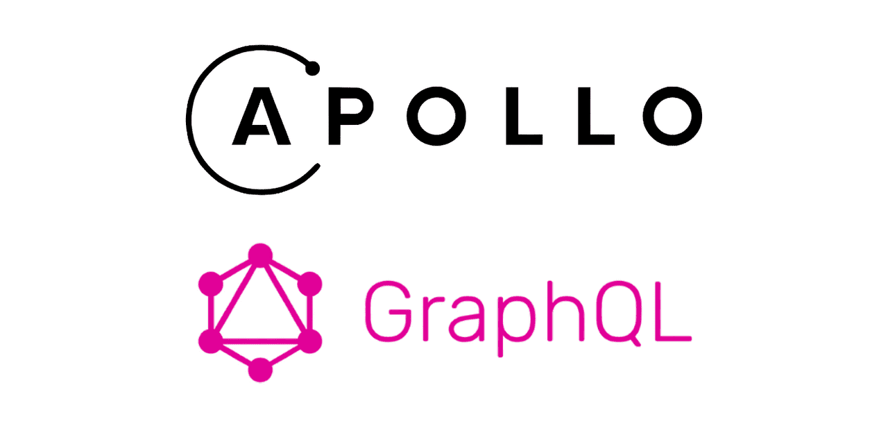

## 시작하며

이번에 GraphQL을 알게 되면서 한 번을 사용해서 서비스를 제공해보고 싶었지만 회사에서 제대로 GraphQL을
적용할 여건이 생기지 않아 개인적으로 간단하게나마 구현해보면서 GraphQL이 무엇인지? 어떤 상황에서 개발에
어울릴지 장점은 무엇인지? 에 대하여 정리해보고 간단하게 테스트 해보았다.

## Express / GraphQL / Appllo 간단 맛보기 1

먼저 일반 서버를 Node.js 만을 사용해서 Backend를 구성해도 되지만 기존에 관심을 가지고 개인적으로 공부하던 Express.js를 사용하기로 했다.
이번 포스팅의 중점은 Express 보단 GraphQL과 Apollo에 맞춰서 포스팅하려 한다.

## GraphQL이란?

GraphQL은 페이스북에서 만든 쿼리 언어로 REST API를 대체하려는 목적으로 만들었다고 한다. 공부하면서 REST API와
가장 큰 차이점이라고 느꼈던 것은 End Point가 하나라는 점이다. REST API 같은 경우 자원, 행위에 따라
여러 End Point를 생성하여 클라이언트에서 원하는 데이터를 요청한다.

## GraphQL의 장점

**GraphQL의 장점은 대표적으로 Overfetching과 Underfetching이다.**

**Overfetching**은 보통 REST API를 사용할 때 예를 들어 한 명의 개발자의 정보를 조회할 때 개발자의 이름 데이터만
사용하려 해도 개발자의 모든 정보를 조회하는 API에 요청하여 이름 데이터를 제외 한 나머지 데이터들은 사용하지
않게 된다. 물론 개발자의 이름만 조회하는 API를 생성하면 되지만 각각 데이터의 API를 생성한다면... 그건 아닌 거 같다.

**Underfetching**은 REST API는 하나의 페이지 구성을 위해서 많은 API를 요청해야 한다. 따라서 여러 End Point에
요청해야 한다. 예를 들어 개발자의 기본정보, 회사 이력, 개발스킬 등을 한 페이지에 구성하게 되면 기본정보, 회사이력, 개발 스킬을 각각의 End Point에 요청해야 한다.

GraphQL은 이러한 REST API가 가진 단점을 보완하게 된다.

## GraphQL의 단점

GraphQL의 단점은 파일 관련 문제와 캐싱, 러닝 커브, **새로운 패러다임의 적응** 등이 있다.

## Apollo란?

Apollo를 공부하면서 Aopllo Clinet와 Apollo Server에 대하여 알아보고 사용했다.

Apollo Clinet는 Apollo 공식 문서를 보면 **"Apollo Client 는 GraphQL로 로컬 및 원격 데이터를 모두 관리할 수있는 JavaScript 용 포괄적 인 상태 관리 라이브러리입니다. 이를 사용하여 UI를 자동으로 업데이트하는 동시에 애플리케이션 데이터를 가져오고, 캐시하고, 수정할 수 있습니다."** 라고 설명했다. 따라서 GraphQL에 최적화돼있고 이를 사용하면 UI를 자동으로 업데이트하고 캐시 수정할 수 있다는 말을 보아. 왜 많은 사람들이 Redux와 Apollo를 비교했는지 알 수 있다.

 

Apollo Server는 **"Apollo Server는 Apollo Client를 포함한 모든 GraphQL 클라이언트와 호환되는오픈 소스 사양 준수 GraphQL 서버입니다.모든 소스의 데이터를 사용할 수 있는 프로덕션 준비가 완료된 자체 문서화 GraphQL API를 구축하는 가장 좋은 방법입니다."**라고 명시되어있다.
따라서 GraphQL 서버를 생성하고 데이터를 보내는데 도움을 주는 모듈이라고 생각이 든다.

Apollo를 사용하면서 느꼈던 특징을 아주 잘 정리된 포스팅을 발견해서 아래 링크를 첨부한다.

[[Apollo] Apollo란 무엇인가?](http://hellominchan.tistory.com/227)

 

다음 포스팅에서는 Express / GraphQL / Appllo-Server를 사용해서
간단하게 GraphQL 서버를 구현하여 보려고 한다.

**다음 포스팅 -**
[**Express / GraphQL / Appllo 맛보기 2 (Mysql)**](/development/express_graphql_apollo2)
