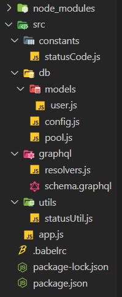

## Express / GraphQL / Appllo 맛보기 2 (Mysql)

이번에는 Expess, GraphQL, Apollo-Server, Mysql을 사용해서 Express와 Mysql 연결과
Apollo-Server를 사용한 GraphQL 서버를 간단하게 만들어 볼려고한다. 추후 다음 포스팅을 통해서
React와 GraphQL, Apollo-Client를 사용해서 클라이언트까지 정말 간단하게 구성해 볼 것이다.
간단하게 혼자 테스트하면서 진행 한 Sample 코드로 그 점은 감안하여 읽어주세요.

GraphQL과 Apollo에 대한 간단한 설명은 이전 포스팅을 참고
<br />

[**Express / GraphQL / Appllo 맛보기1**](/development/express_graphql_apollo1/)

포스팅은 Node 개발환경 셋팅이나 IDE(개발 툴)의 설정이 되었다는 가정하에 진행하겠다. 개발 설정이 필요하다면
아래 포스팅을 참고
<br />

[**Node란? 설치 및 맛보기**](/development/node_install/)

## 기본 설정

먼저 커멘트나 터미널을 이용하여 프로젝트를 생성하고 npm init을 통하여 package.json을 생성한다.

```bash
// 프로젝트 폴더 생성
mkdir express-graphql-apollo
cd express-graphql-apollo
npm init
```

### nodemon (핫 로더) 설치

nodemon은 디렉토리의 파일 변경이 감지되면 노드 애플리케이션을 자동으로 다시 시작하여 node.js 기반 애플리케이션을 개발하는 데 도움이 되는 도구로 개발 소스를 수정하면 nodemon이 변경을 감지하고 재시작한다.

```bash
npm install --save-dev nodemon
```

### Babel 설치 & 설정

Es6 문법을 사용하여 개발하기 위해서 Babel 설정을 진행하였다.
Babel에 대해서는 무척 좋은 포스팅이 많기 때문에 생략한다.

```bash
npm install --save-dev @babel/core @babel/node @babel/preset-env
```

폴더 상위 src에 .babelrc 파일을 생성하고 아래와 같이 babel/preset-env에 설정된 패키지들을 사용하도록 설정한다.

```bash
// .babelrc 파일
{
  "presets": ["@babel/preset-env"] // 바벨 플러그인 모음
}
```

<br />

## Express, GraphQL Parser, Apollo, Mysql 설치

다음은 Express와 GraphQL Parser, Apollo, ,Mysql 등 필요한 npm 모듈을 설치한다.
Express를 통한 apollo 서버 개발을 편하게 진행하기 위해서 apollo-server-express를 사용하였다.

```bash
npm install apollo-server-express body-parser-graphql compression express promise-mysql
```

## Express, ApolloServer 설정

먼저 src 폴더를 생성하고 src 폴더 안에 app.js 파일을 생성한다.
아래와 같은 과정으로 ApolloServer 서버를 생성하고 express를 ApolloServer의 미들웨어로 추가하여
graphql EndPoint를 생성한다.

**app.js**

```js
// src 안에 app.js 파일
import express from 'express';
import { ApolloServer } from 'apollo-server-express';
import { bodyParserGraphQL } from 'body-parser-graphql';
import compression from 'compression';
import resolvers from '../src/graphql/resolvers';
import fs from 'fs';

// Node file system을 사용하여 gql schema 가져옴
const typeDefs = fs.readFileSync('src/graphql/schema.graphql', {
  encoding: 'utf-8',
});

const port = 8000;
const app = express();

app.use(bodyParserGraphQL());
app.use(compression());

// ApolloServer 생성
const server = new ApolloServer({
  typeDefs,
  resolvers,
  introspection: true, // 스키마 검사 활성화 default: true
  playground: true, // playgorund 활성화 default: true
});

server.applyMiddleware({
  app,
  path: '/graphql',
});

app.listen(port, async () => {
  console.log('graphql api server open');
});
```

bodyParserGraphQL과 compression을 미들웨어로 추가하여 사용했다. <br />
**bodyParserGraphQL** : gql(쿼리)를 해석하기 위해 사용. <br />
**compression** : gzip 압축을 사용하여 웹 앱의 속도를 높이기 위하여 사용.

여기까지 진행하면 최상단 폴더 에는 src, .babelrc, package.json, package-lock.json가 있고 src 폴더 안에는
app.js 파일이 있는 상태일 것이다.


## GraphQL 설정

이번엔 src 하위에 graphql 폴더를 만들고 GraphQL 관련 파일들을 넣어보자.
두가지 파일을 생성할 것인데. GraphQL 스키마 언어(GraphQL schema language)를 정의하는 schema.graphql 파일과
스키마에 정의한 것들을 데이터를 불러오고 어떤 식으로 가공하여 전달할 것인지를 정하는 resolvers 파일이다.

GrapthQL 스키마 타입은 공식 문서에 보기 좋게 나와있다.
<br />
[**GraphQL: API를 위한 쿼리 언어**](https://graphql-kr.github.io/learn/schema/)

GraphQL 타입에는 일반적으로 객체타입을 많이 사용하겠지만 특수한 두 가지 타입이 **Query, Mutation**으로
Query는 데이터를 읽고(R). Mutation은 등록수정삭제(CUD)를 정의한다.

간단하게 User의 목록을 불러오고 추가해보려고 한다. 먼저 개인 로컬 서버에 Mysql DB를 생성하고 User테이블에
userName과 userId 필드를 생성하여 준다.
<br />

**schema.graphql**

```js
type User {
  userId: String
  userName: String
}

type Query {
  users: [User]
}

type Mutation {
  addUser(userId: String!, userName: String!): Boolean
}
```

User라는 객체타입을 정의하고 userId와 userName을 String 타입으로 정의하였다. String!처럼 !가 붙은 타입은
꼭 받아야하는 타입임을 명시한다.
테스트를 해보면서 GraphQL 타입 정의는 타입 스크립트의 타입 정의와 유사하다고 생각했다.

**resolvers.js**

```js
import user from '../db/models/user';
import StatusCode from '../constants/statusCode';

const resolvers = {
  Query: {
    users: async () => {
      const result = await user.selectAll();
      return result.data;
    },
  },

  Mutation: {
    addUser: async (_, { userId, userName }) => {
      const result = await user.insert(userId, userName);
      return result.code === StatusCode.OK ? true : false;
    },
  },
};

export default resolvers;
```

위에는 간단하게 resolver를 만들어서 Query에 유저목록를 조회하는 users를 만들고 Mutations에는 유저를 등록하는
addUser를 정의한 스키마에 맞게 작성했다. StatusCode는 간단하게 Constant 정의한 것으로 굳이 만들 필요는 없지만
src 하위에 constatns 폴더를 만들고 아래와 같이 간단하게 구현해놨다.

**statusCode.js**

```js
const statusCode = {
  OK: 200,
  ERORR: 400,
};

export default statusCode;
```

또 DB를 통해 받아온 데이터의 성공여부와 결괏값을 확인하기 위해 간단하게 util을 생성했다. 이 부분 또한 밑에서 DB 데이터 조회 시 만들어 사용해도 되고 안 해도 무관하다. 해당 파일은 src 하위에 utils 폴더를 만들고 아래와 같이 구현해놨다.

**statusUtil.js**

```js
import StatusCode from '../constants/statusCode';

const statusUtil = {
  success: data => {
    return { code: StatusCode.OK, data: data };
  },
  false: () => {
    return { code: StatusCode.ERORR };
  },
};

export default statusUtil;
```

여기까지 GraphQL 사용해 User 목록과 추가를 할수 있도록 스키마와 리졸버를 생성했다.
마지막으로 Express와 Mysql을 connection 맺어 DB의 데이터를 가져와 resolver가 데이터를 사용하도록 해보자.
<br />
현재 폴더 구조와 파일은 아래와 같을 것이다.


## Mysql(DB) Connection 설정

promise-mysql를 사용하여 async/await를 사용하여 connection을 맺고 함수를 생성하여 생성하였다.
먼저 src 하위에 db 폴더를 생성하고 아래 작업을 진행한다.

**config.js**

```js
import mysql from 'promise-mysql';

const dbConfig = {
  host: 'localhost',
  port: 3306,
  user: '유저정보',
  password: '패스워드정보',
  database: 'graphql_test',
};

export default mysql.createPool(dbConfig);
```

config.js 파일은 DB 접속 정보를 기록하고 풀을 생성하여 넘겨주면 된다.

**pool.js**

```js
import poolPromise from './config';

const pool = {
  query: async (query, value) => {
    let result;
    const pool = await poolPromise;
    try {
      var connection = await pool.getConnection();
      result = value
        ? await connection.query(query, value)
        : (await connection.query(query)) || null;
    } catch (err) {
      console.log(err);
      connection.rollback(() => {});
    } finally {
      pool.releaseConnection(connection);
      return result;
    }
  },
};

export default pool;
```

pool을 생성하고 connection하여 데이터를 받아와 connection을 종료하기까지 과정을 반복해서 하지 않기 위해
위와 같이 함수로 정의하였다.

<br />

마지막으로 models 폴더를 만들고 각 테이블 별로 필요한 SQL를 작성하고 데이터를 읽어 오도록 했다.
지금은 User 관련 테이블만 있기에 models 폴더 안에 user.js 파일만 만든다.

**user.js**

```js
import statusUtil from '../../utils/statusUtil';
import pool from '../pool';

const tableName = 'user';

const user = {
  selectAll: async () => {
    const query = `SELECT * FROM ${tableName}`;
    const result = await pool.query(query);

    return result ? statusUtil.success(result) : statusUtil.false();
  },
  insert: async (userId, userName) => {
    const query = `INSERT INTO ${tableName} (userId, userName) VALUES (?, ?)`;
    const result = await pool.query(query, [userId, userName]);

    return result ? statusUtil.success(result) : statusUtil.false();
  },
};

export default user;
```

전체 사용자를 불러오는 함수와 사용자를 등록하는 함수 두 개를 정의하고 각 쿼리를 작성했다.
위에 pool.js에 보면 value가 있을 경우 connection에 두 번째 인자로 배열을 넘겨주는데 insert 쿼리에서

INSERT INTO \${tableName} (userId, userName) VALUES (?, ?) ? 로 작성된 값이 자동으로 매핑되어 들어간다.
위에서는 userId와 userName이 자동으로 매핑되게 된다.
이렇게 작성된 함수들은 resolver에서 사용하여 데이터를 읽는다.

## 실행 스크립트 생성

이제 서버를 실행할 수 있도록 스크립트를 작성해보자 package.json에 아래와 같이 start를 만들어준다.
nodemon과 babel을 사용하고 만들었던 app.js를 실행한다.

```js
  "scripts": {
    "start": "nodemon --exec babel-node src/app.js",
    ....
  },
  ....생략
```

여기까지 모든 설정을 완료했다. 그럼 테스트를 해보자.



## GraphQL Playground 테스트

우리는 app.js 서버를 8000번 ApolloServer에 graphql로 express를 연결했다.
npm start를 실행하여 서버를 실행해보자. 아래와 같이 nodemon을 사용해 시작하고 서버 구동이
됐음을 알 수 있다.


<br />

이제 localhost:8000/graphql로 접속해보자.


위와 같이 생성 한 gql을 테스트할 수 있는 Playground가 실행된다! 우리가 ApolloServer 생성 당시
playground를 true로 줬는데 기본 설정이 true기 때문에 굳이 설정을 안 해줘도 되지만 옵션에 대해 설명하기 위해서
적어 놨었다.

Playground에 오른쪽 탭에는 자신이 만든 schema와 docs를 확인할 수 있다. 위에서 만든 users와 addUser가
docs에 표출되어있다. 그럼 user를 추가하고 목록을 불러와 보자.

## Mutation(유저 데이터 등록)

Mutation으로 작성했던 addUser를 추가한다. gql을 작성하고 가운데 재생 모양을 클릭하면 실행된다.
위에서 스키마 작성 시 결과 값을 Boolean으로 했기 때문에 true로 문제없이 실행되었다는 걸 알 수 있다.


## Query (유저 목록 호출)


위와 같이 작성했던 query users에 필요한 정보를 데이터만 불러오면 된다. 예를 들어 위에처럼 userId만 조회할 수도 있고 userId, userName 두 가지가 필요하면 userId, userName을 users안에 정의하면 된다. 따라서 스키마를 정의하고 안에 필요한 데이터만 불러올 수 있게 된다 여기서 언급한 GraphQL의 장점인 Overfetching을 해소한다는 점이 여기서 느껴졌다. 위에 소스들을 바탕으로 여러 가지 궁금 한 테스트를 진행해보면 될 거 같다.

#### _문제 될 만한 설명이나 소스가 있으면 댓글로 알려주시면 수정하겠습니다._
