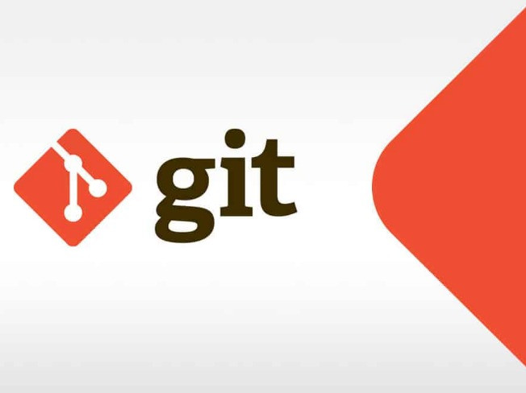

## git stash 간단사용
- git stash는 작업 디렉토리에 unstaged 파일들을 백업하고 작업 디렉토리를 깨끗한 상태로 만드는 것이다.
- commit되기 이전 작업 중 파일과 git add로 추가된 파일 까지 모두 stash 영역으로 저장되며 수정분량은 제거 된다.

### 필요했던 상황
작업 환경에 따라 git flow를 통한 개발 방법론을 택하여 진행중인 프로젝트에 깜박하고 master, develop에 작업을 했었다.
commit을 친 상태가 아니였고 git stash를 사용 하기로 했다.
아래는 간단한 stash 활용이다.

### git stash 저장 및 확인
~~~sh
// git stash를 통하여 작업한 내용을 백업한다. (git stash save 동일)
git stash

// 작업이 재대로 됐을경우 아래와 같이 표출
Saved working directory and index state WIP on develop: 30be761 [최근 커밋 내용]

// git stash 목록을 확인한다.
git stash list

// git stash 상세내용 확인
git stash show stash이름

// 다음으로 원하는 브렌치로 이동하거나 깃 플로우를 통해 feature 생성한다.
~~~

### git stash 적용
~~~sh
// stash에 백업 된 작업 내용을 현재 작업 디렉토리에 적용 후 stash 삭제
git stash pop

// stash에 백업 된 작업 내용을 현재 작업 디렉토리에 적용 후 stash 보존
git stash apply
~~~