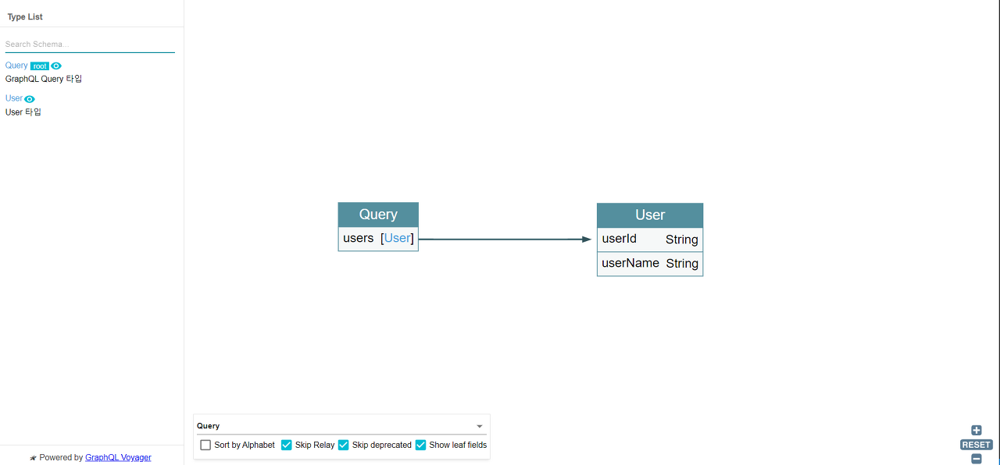

## graphql-voyger사용

최근에 GraphQL에 대해서 궁금증을 가졌었다. 간단하게라도 직접 해보는 게 생각정리도 빠르고
더욱 유익하다고 느껴 저번 포스팅에서 간단하게 Express, React와 Apollo, GraphQL을 사용해서 서버와 클라이언트를
생성했다. 이번에 Naver DEVIEW 프론트엔드 GraphQL 관련 영상을 보면서 graphql-voyager를 알게 되었다.

## graphql-voyager?

graphql-voyager는 GraphQL 스키마를 시각화하여 보여주는데 협업하는 여러 개발자가 참고할 수 있도록 지원한다.
언젠가 GraphQL을 사용해서 프로젝트를 진행하면 적용하기 위해 정말 간단하게 이전에 구현했던 Express에 미들웨어로 추가하여 테스트해봤다.

## graphql-voyager 설치 및 실행

일단 Express를 사용하여 GraphQL을 적용했다는 가정하에 설명한다.
이전에 Express, Apollo, GraphQL로 서버를 구축했던 포스팅이다. (필요 시 참고)

[**Express / GraphQL / Appllo 맛보기 2 (Mysql)**](/development/express_graphql_apollo2)

### graphql-voyager 설치

```bash
npm install graphql-voyager
```

### graphql-voyager Express 미들웨어로 추가

```js
const app = express();
// 미들웨어 추가
app.use("/voyager", voyagerMiddleware({ endpointUrl: "/graphql" }));

... 생략
```

## graphql-voyager 테스트

설치를 하고 Express 미들웨어로 추가했으니 서버를 실행하고 설정한 /voyager로 이동해보자.
현재 테스트 서버에는 아래와 같이 스키마를 구성했다.

```js
"User 타입"
type User {
  userId: String
  userName: String
}

"GraphQL Query 타입"
type Query {
  users: [User]
}

"GraphQL Mutation 타입"
type Mutation {
  addUser(userId: String!, userName: String!): Boolean
}
```

위에 정의한 스키마들의 연관관계와 정보를 테이블로 표출하여 나오는 모습이다.
오른쪽 하단에 셀렉트 박스로 각 스키마 타입을 변경하여 볼 수 있다. 나중에 개발을 진행하면
이런 좋은 모듈이 개발하는데 정말 도움이 될 거 같다는 생각이 든다.


