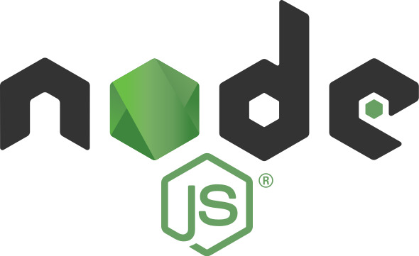
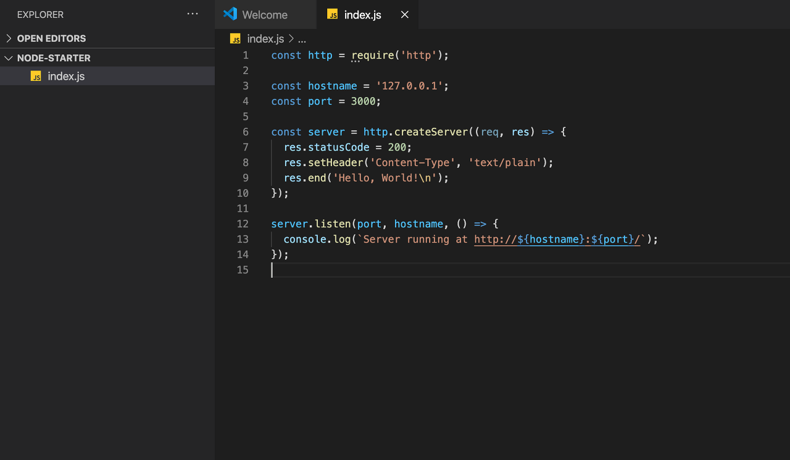
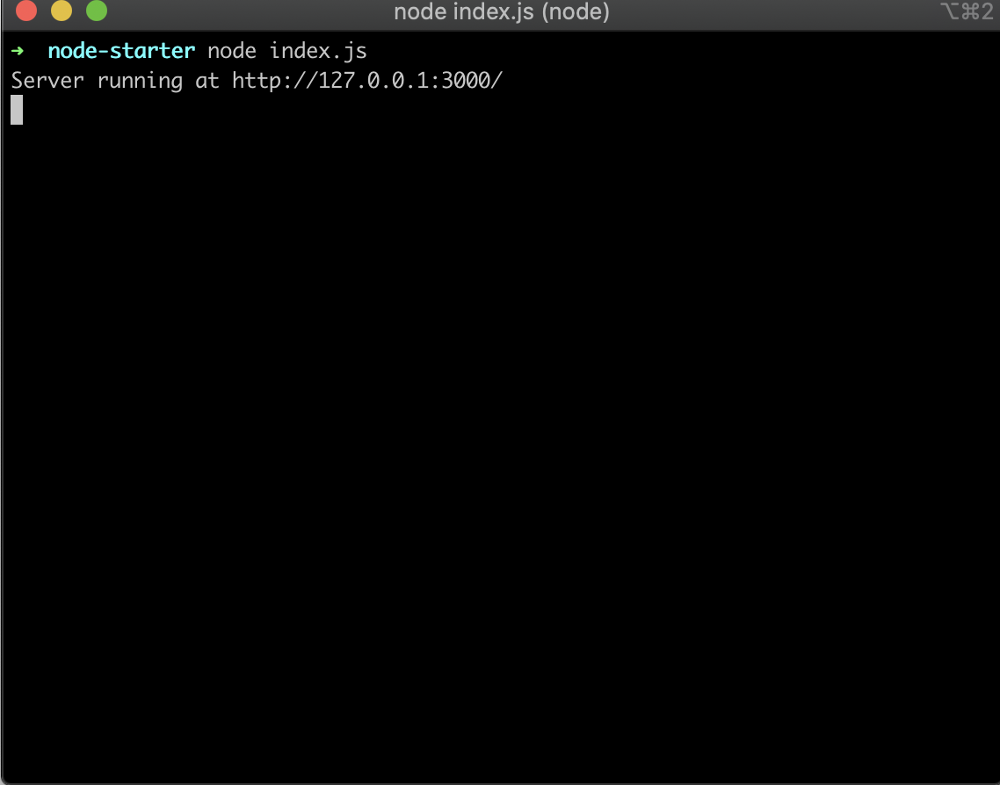

## 시작하며

작년부터 Vue나 React 평소에 관심이 있던 SPA들을 공부하고 프로젝트를 진행하면서 자연스럽게
node에 대한 관심이 생기게 되었고 node를 기반으로 한 api 서버를 구축해보고자 인프런에서 온라인 강의를
듣게 되었다. 강의를 들으면서 알게 된 지식과 덧붙여 개인적으로 공부하여 알게 된 점들을 포스팅하려고 한다.

## Node.js 란?

구글링을 해보면 **Node.js는 확장성 있는 네트워크 애플리케이션 개발에 사용되는 소프트웨어 플랫폼이다.** 라고 나온다.
왜 그렇게 이야기할까? 다들 알고 있듯이 JavaScript는 브라우저에서 동작하는 언어이다.
Node는 이런 Javascript 코드를 브라우저 밖에서도 실행할 수 있도록 해준다. 아마 직접 구현은 아직 못해봤지만,
Electron 같은 프레임워크가 나올 수 있게 된 것도 다 Node 덕분이라 할 수 있겠다.

## Node.js 특징

- V8 엔진 사용
- 이벤트 기반 비동기 I/O 프레임워크
- CommonJS를 구현 한 모듈 시스템

 

Node가 chrome에서 사용하는 V8 엔진을 사용하면서 앞서 설명한 JavaScript 코드가 브라우저 밖에서도 실행할 수 있게 된다.
V8 엔진은 간단하게 JavsScript 코드를 해석한다고 생각하면 된다.
또 Node는 이벤트 기반 비동기 I/O 프레임워크다. Node는 클라이언트의 요청을 싱글 스레드로 이벤트 루프를 만들어 처리한다.
이벤트 큐에 쌓인 이벤트들을 하나하나 처리하여 클라이언트에게 응답하여준다. 여기서 비동기 I/O는 무거운 잡들을
비동기로 처리하는 워커를 통하여 처리한 후 이벤트 루프가 받아 처리하는 것을 뜻한다.
Node는 CommonJs를 사용한다. 다른 사용자가 만든 서드파티 모듈이나 개발자가 모듈을 내보내고/불러오는 것을
더 명시적으로 사용할 수 있다.
예를 들어 ES5 문법에서 require로 불러오고 module.exports 내보내는 것들이 CommonJS를 활용한 것이라 볼 수 있다.

## Node 설치 및 IDE 설치

먼저 아래 링크를 통해 Node를 설치하여 준다. 공식 Node 포털에도 나온 것처럼 최신 버전을 설치해도 되지만,
안정적인 버전을 설치하는 것을 추천한다.
https://nodejs.org/ko/

다음 IDE 개발 툴은 VisualStudioCode나 Atom 등을 많이 사용하는 거로 알고 있는데, 지금 현재 사용 중인
VisualStuidoCode로 진행하겠다.
https://code.visualstudio.com/

## Node.js 맛보기 HelloWorld

이제 간단하게 Node로 서버를 구축하여 HelloWorld를 표출해보자.
아래 링크로 접속하시면 Node로 HelloWorld를 표현하는 소스코드와 설명이 있다.
 
https://nodejs.org/dist/latest-v12.x/docs/api/synopsis.html.

 
먼저 그럼 원하는 경로 폴더를 만든 후 VSCode(VisualStudioCode) 개발 툴을 실행하여 준다.
혹시나 commandLine을 자주 사용하시는 분들은 window cmd나 mac terminal에서 해당 폴더 이동 후 code . 을 입력하시면
VSCode가 실행된다.

그럼 아래와 같이 index.js파일을 생성하고 위에서 가져온 소스를 붙여준다.

 

간단하게 설명하면 http라는 node에 포함된 모듈을 통해서 node 서버를 실행시키는 소스다.
http.createServer 함수를 통해 서버를 생성하고 만들어진 server.listen을 통해 3000번 port의 접속을 대기합니다. 소스를 보면
접속을 대기하는 listen에 console.log에 접속 시 서버가 구동 중이다.라는 영문 문구가 있다.
그렇다면 우리가 서버를 구동하면 저 문구가 표출되어야 한다.

 

아래와 같이 각 운영체제에 맞게 cmd나 teminal에 node index.js로 index.js를 실행하면 서버가 실행중이다. 라고 표출된다.

현재 자신의 ip를 뜻하는 127.0.0.1에 3000번 port로 서버가 구동 중이므로 브라우저를 통해
http://127.0.0.1:3000에 접속하여 본다. 정상 작동이 되었다면 아래와 같이 Hello World! 가 표출된다.

 

Node 애플리케이션을 빠르고 간편하게 개발하기 위해 Express란 프레임워크를 많이 사용하는데, 온라인 강의를 진행하면서
Express.js도 어느 정도 지식을 습득한 후에 누군가에게 도움이 되도록 포스팅해야겠다.
