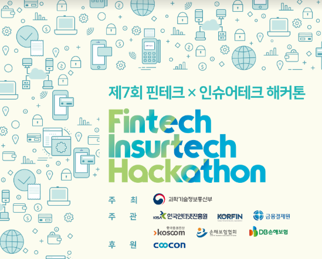
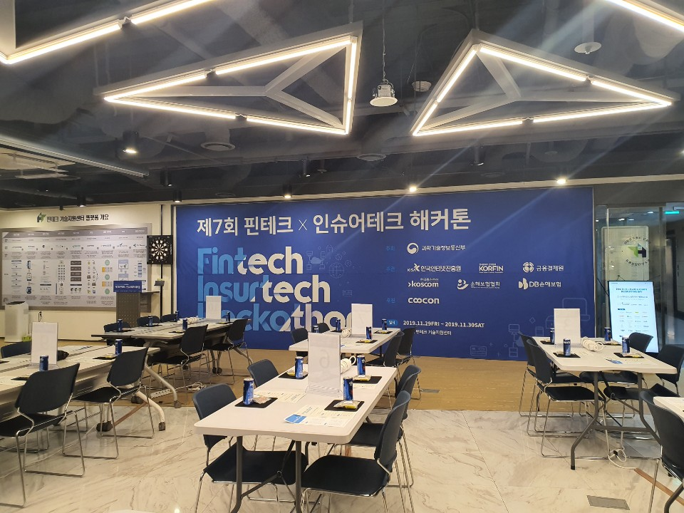
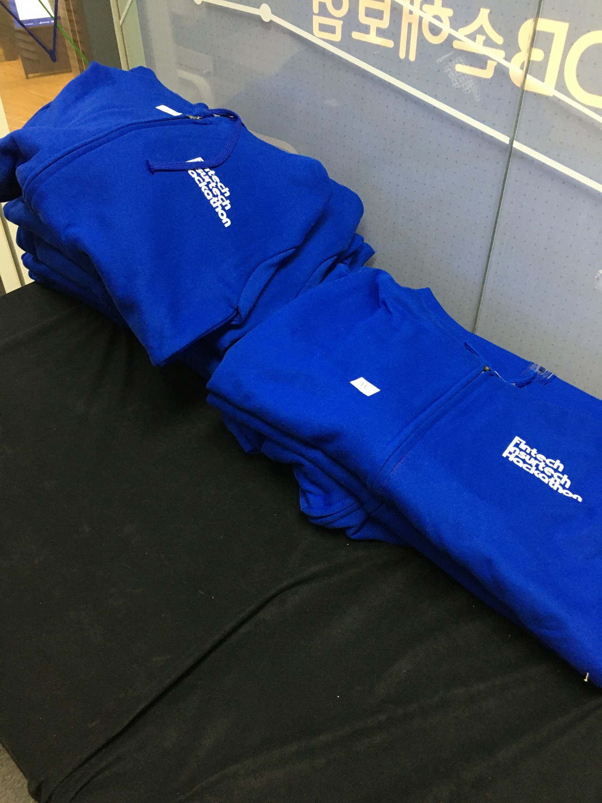
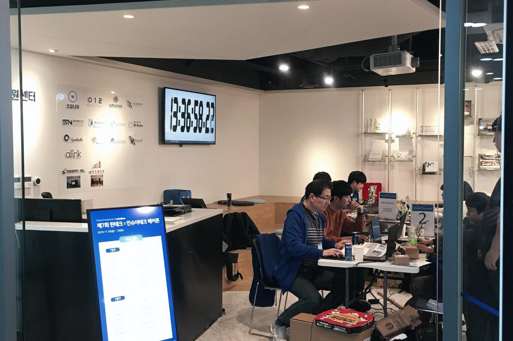
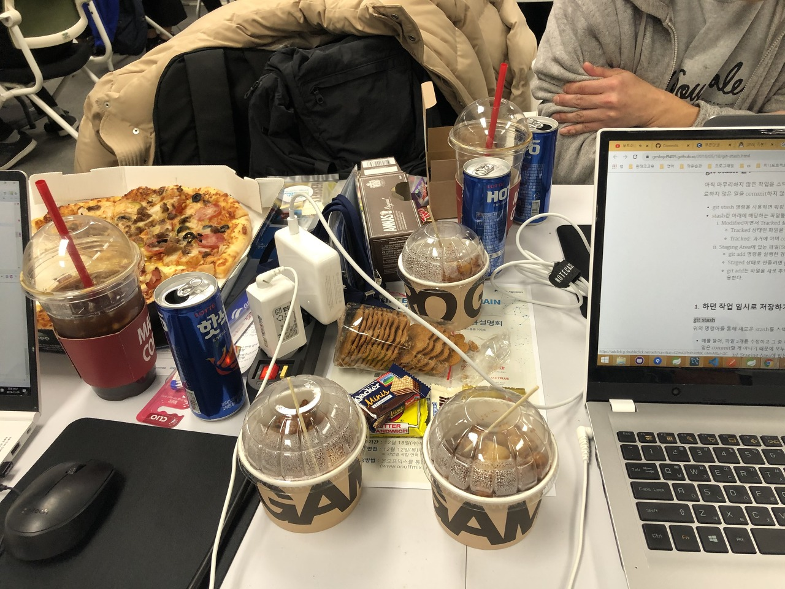
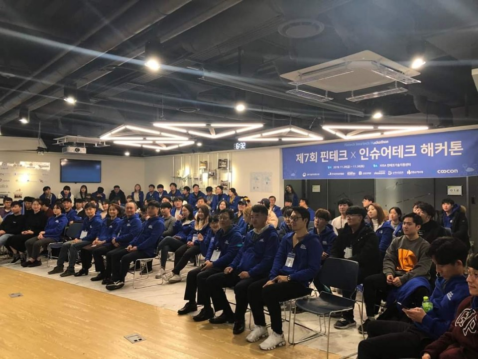

## [KISA] 제7회 핀테크×인슈어테크 해커톤

한국인터넷진흥원에서 한국핀테크산업협회, 금융결제원, 코스콤, 손해보험협회와 함께 "제7회 핀테크×인슈어테크 해커톤을 개최하여 이번에 같이 공부하는 친구들과 함께 참가하게 되었습니다.  
대회정보 - https://www.onoffmix.com/event/194608

 

신청기간동안 거의 매주 만나 여러 아이디어를 기획하고 서류를 제출하여 선정되었습니다.  
서류합격 후 개발기간이 넉넉한 편이 아녔기에 아주아주 맡은 역할에 열심히 했던 것 같습니다.

위처럼 여러 팀이 무박 2일 동안 개발을 진행할 수 있도록 좋은환경을 제공하여 줍니다.

회사를 마친 후 도착해서 위와같이 해커톤 마크가 있는 후드 집업을 제공하여 주고  
많은 분들이 개발을 진행하고 있었습니다. 위에 보이는 모니터에 시간은 해커톤 발표 시작까지 남은 시간입니다.  

중간중간 대회에서 밤새면서 먹을 수 있게 닭강정, 피자, 라면 등등 야식을 제공하여 주고 아침에는  
샌드위치, 점심에는 김밥을 제공하여 줬습니다. 다 먹지 못할정도로 너무 많이 주셔서 조금 놀랬습니다.

무박 2일동안 팀원 간 개발을 진행하고 주관기업분들꼐 설명 5분 질문 답변시간 2분 총 7분 동안  
해당 팀들에 핀테크x인슈어 서비스들을 소개하고 위 사진과 같이 간단한 수상식을 진행하였습니다.

저 사진을 찍을 때까지만 해도 저의 팀원들은 모두 크게 참여에 의의를 두고 있었기에  
수상은 기대 안 하고 있었는데 우수상을 받게 되어 이번 연도 마지막에 정말 좋은 추억을 쌓게 된 거 같습니다.