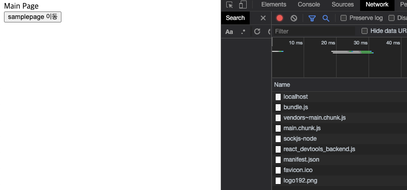

## Code Splitting과 cra-bundle-analyzer

React는 빌드되면서 Webpack을 통한 번들링 작업을 하게 된다. cra로 React를 시작할 경우 기본적으로
Webpack, Babel 설정이 되는데 번들링이 되면서 하나로 합쳐진 js는 프로젝트가 커질수록 용량도 커지고
그로 인해 페이지 최초 접속 시 CSR 특성상 리소스들과 하나로 된 js 파일을 불러오는데 오래 걸리게 된다.
따라서 React에서는 코드분할(Code Splitting)을 하라고 설명하고 있다. React 공식문서에도 아래와 같이 설명하고 있다.
**코드 분할은 여러분의 앱을 “지연 로딩” 하게 도와주고 앱 사용자에게 획기적인 성능 향상을 하게 합니다. 앱의 코드 양을 줄이지 않고도 사용자가 필요하지 않은 코드를 불러오지 않게 하며 앱의 초기화 로딩에 필요한 비용을 줄여줍니다.**
그렇다면 어떻게 Code Splitting을 적용하고 그것을 확인할 수 있을까?
포스팅에서는 CRA를 사용해서 React를 생성하고 CRA 번들링 결과물을 webpack 설정 없이 확인할 수 있게 도와주는
cra-bundle-analyzer를 사용해서 확인해보자.

## React.lazy 사용

React에선 lazy를 사용해서 Code Splitting을 지원한다. React.lazy는 페이지별 Router Base, 컴포넌트 별 코드분할(Code Splitting)을 사용한다.
**주의점 - React.lazy는 서버사이드 렌더링에서는 지원하지 않는다.**
공식문서에서도 서버사이드 렌더링에서는 **Loadable Components** 사용을 추천하고 있다.
이번 포스팅에서는 Route-based Code Splitting (페이지 별 코드 분할)을 진행해보자.

## CRA를 통한 React 프로젝트 생성

먼저 Route-based인 페이지 별 Code Splitting (코드 분할)을 적용해보자.
먼저 간단하게 cra 명령어를 통해서 React 프로젝트를 생성해보자.

```bash
npx create-react-app code-splitting-ex
```

React Route 설정을 위해서 react-router-dom을 설치한다.

```bash
npm install react-router-dom
```

다음은 Route 설정을 위해서 index.js를 아래와 같이 수정해준다.

```js
import React from "react";
import ReactDOM from "react-dom";
import App from "./App";
import { BrowserRouter } from "react-router-dom";
import reportWebVitals from "./reportWebVitals";

ReactDOM.render(
  <React.StrictMode>
    <BrowserRouter>
      <App />
    </BrowserRouter>
  </React.StrictMode>,
  document.getElementById("root")
);

...
```

### MainPage.js 생성

MainPage에서는 router useHistory hook을 통해서 Code Splitting 작업 후 페이지 이동을 통해서 분할되어 js를 가져오는지
확인하기 위해서 아래와 같이 작업한다.

```js
import { useHistory } from 'react-router-dom';

const Main = () => {
  const history = useHistory();

  const onSampleMoveClick = () => {
    history.push('/sample1');
  };

  return (
    <>
      <div>Main Page</div>
      <button type="button" onClick={onSampleMoveClick}>
        samplepage 이동
      </button>
    </>
  );
};

export default Main;
```

### SamplePage1.js 생성

번들링 된 페이지가 적절하게 분리되었는지 확인하기 위해서 react-color 모듈을 SamplePage1에 import 해놓자.

```bash
// react-color 설치
npm install react-color
```

```js
import { SketchPicker } from 'react-color';

const SamplePage1 = () => {
  return (
    <>
      <div>Sample Page1</div>
      <SketchPicker />
    </>
  );
};

export default SamplePage1;
```

### App.js 수정

이제 페이지 별로 번들링 된 파일을 확인하기 위해서 App.js를 아래와 같이 작업해주자.
SamplePage2 컴포넌트에는 테스트를 위해 텍스트 문구만 기입했다.

```js
import { Route, Switch } from 'react-router-dom';
import MainPage from './MianPage';
import SamplePage1 from './SamplePage1';
import SamplePage2 from './SamplePage2';

function App() {
  return (
    <>
      <Switch>
        <Route exact path="/" component={MainPage} />
        <Route path="/sample1" component={SamplePage1} />
        <Route path="/sample2" component={SamplePage2} />
      </Switch>
    </>
  );
}

export default App;
```

현재 폴더 구조는 아래와 같다.


이제 npm run start 명령어를 통해서 프로젝트를 시작하고 페이지 이동 버튼을 통해서 페이지를 이동해보자.
/ 로 Route를 지정한 MainPage가 페이지에 로드되고 samplepage이동 버튼을 누르게 되면 페이지가 이동할 것이다.
페이지 이동 시 확인해야 할 점은 F12를 통해 개발자 모드로 network 탭에 아래와 같이 페이지가 이동되어도 추가적으로 로드되는 파일이
없다는 것을 확인해야 한다.

**MainPage**


**SamplePage1**


확인해보면 번들링 된 파일이 나눠져 있지 않고 하나로 로드되기 때문에 처음 MainPage에서 모두 로드되어 SamplePage로 넘어가도 다른 js파일이 로드되지 않는 걸 볼 수 있다.

## cra-bundle-analyzer 사용

cra-bundle-analyzer를 통해서 webpack 설정 없이 번들링 된 js 파일을 확인해보자.
**cra-bundle-analyzer 설치**

```bash
npm install -D cra-bundle-analyzer
```

**cra-bundle-analyzer 확인**
아래 명령어를 실행하면 build 폴더에 report.html 파일이 생성될 것이다.

```bash
npx cra-bundle-analyzer
```

아래 사진처럼 webpack을 통해서 node_modules이 번들링 되어 하나의 js파일로 생성 된 것을 확인할 수 있다.
SamplePage1에 사용된 react-color 또한 있는 것을 확인할 수 있다.
그럼 SamplePage1에서만 react-color가 사용되도록 분리해보자.

**report.html**


## Route-based code splitting 사용

이제 그럼 React.lazy를 통해서 페이지 별로 코드를 분할해보자.
아래와 같이 App.js를 수정하자 React.lazy사용을 위해서 Suspense를 통해서 Route를 감싸주고 React.lazy를 통해
각 페이지 컴포넌트들을 import 해서 Route에 적용한다.
주의 할 점은 Suspence로 감싸줘야하고 fallback prop은 넘겨줘야한다.

### App.js 수정

```js
import { Suspense, lazy } from 'react';
import { Route, Switch } from 'react-router-dom';

const MainPage = lazy(() => import('./MianPage'));
const SamplePage1 = lazy(() => import('./SamplePage1'));
const SamplePage2 = lazy(() => import('./SamplePage2'));

function App() {
  return (
    <>
      <Suspense fallback={null}>
        <Switch>
          <Route exact path="/" component={MainPage} />
          <Route path="/sample1" component={SamplePage1} />
          <Route path="/sample2" component={SamplePage2} />
        </Switch>
      </Suspense>
    </>
  );
}

export default App;
```

자 이제 다시 npm run start를 통해서 프로젝트를 실행하고 아까 전 크롬 개발자 모드 network탭을 통해서 확인해보자.

**MainPage**


**SamplePage1**


아까 전과 다르게 SamplePage로 이동하면 0.chunk.js 와 2.chunk.js파일이 페이지 이동과 함께 불러와지는 걸 확인할 수 있다.
그럼 아까 전 cra-bundle-analyzer로 확인한 번들링 된 결과물도 바뀌었나 확인해보자.

다시 한번 아래 명령어를 통해서 cra-bundle-analyzer를 실행하자

```bash
다시 한번 아래 명령어를 통해서 cra-bundle-analyzer를 실행하자
```

**report.html**


이전 Code Splitting 하기 전과 비교했을 때 node_modules이 SamplePage1에서만 사용될 수 있도록 또는 필요한 컴포넌트에서만
사용 될 수 있도록 분리된 것을 볼 수 있다.
즉 우리가 설치한 모듈을 분리하여 필요한 페이지에서 따로따로 불러오게 된다.

Code Splitting은 페이지 별, 모듈 별이나 두 가지를 혼합해서 사용할 수 있는데 이번 포스팅에서는 페이지 별 Code Splitting을 알아보았다.
React 공식 문서에도 코드 분할을 어떤 곳에 적용할지 정하는 것은 까다롭다고 이야기하고 있다. 이제 React를 공부하고 사이트를 최적화에 대해 고민하고 있다면 대체로 쉬운 Route 기반 코드 분할을 적용해 보고 점차 알맞은 코드 분할 방법을 찾아보자.
