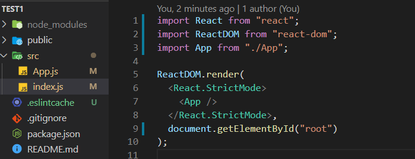
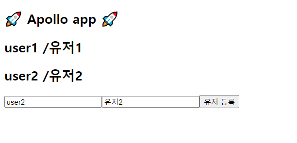

## React, GraphQL, Apollo 맛보기

GraphQL을 공부하면서 서버를 간단하게 개발해보고 이후 적용할 만한 프로젝트가 있으면 사용해보고자 했지만
하면서 프론트엔드에는 어떤 식으로 Apollo가 Redux를 대체할 수 있다는 것인지와 프론트엔드에 간단하게라도
붙여보고 싶어 테스트를 해본 경험을 공유하고자 한다.

### Express, GraphQL, Apollo Server

작업 진행 시 서버 구현에 대한 정보가 궁금하다면 아래 포스팅을 참조 <br />
[**Express / GraphQL / Appllo 맛보기 2 (Mysql)**](/development/express_graphql_apollo2/)

## 설정

이번 포스팅에선 React에 대한 어느 정도 지식이 있다는 가정하고 진행한다.
먼저 CRA로 프로젝트를 생성하여 준다.

```bash
npx create-react-app react-graphql-apollo
```

src 아래 App.js, index.js 파일을 제외한 파일을 전부 삭제하여 준다.


### GraphQL, ApolloClient 설치

아래 cli를 통해서 ApolloClient와 GraphQL을 설치해준다.

```bash
npm install @apollo/client graphql
```

### ApolloClinet 생성

apollo 설정을 위해서 src 아래에 apollo 폴더를 만들고 index.js 파일을 생성했다.
**src/apollo/index.js**

```bash
import { ApolloClient, InMemoryCache } from "@apollo/client";

const client = new ApolloClient({
  uri: "http://localhost:8000/graphql",
  cache: new InMemoryCache(),
});

export default client;
```

이전 포스팅에서 작업했던 서버의 EndPoint를 uri에 넣고 cache에 InMemoryCache를 사용했다.
ApolloClient는 gql의 결과를 InMemortCache에 저장하고 불필요한 네트워크 요청을 하지 않는다고 한다.
cache부분은 추후에 추가적으로 공부하고 포스팅하려 한다.

apollo 폴더 아래에 gqls폴더를 만들고 각 서비스별로 구분 지으려고 한다. 현재 샘플에는 user데이터로만 테스트했으므로 gql 폴더 안에 user.js 파일만 생성하였다.

**src/apollo/gqls/user.js**

```js
import { gql } from '@apollo/client';

const GET_USERS = gql`
  query {
    users {
      userName
      userId
    }
  }
`;

const ADD_USER = gql`
  mutation AddUser($userId: String!, $userName: String!) {
    addUser(userId: $userId, userName: $userName)
  }
`;

export { GET_USERS, ADD_USER };
```

위에 user.js에서는 서버에서 작업한 유저 목록 조회와 유저 등록 2가지 스키마에 gql만 작성했다.
다른 GraphQL 서버로 테스트할 경우 서버에서 정의한 스키마에 맞춰 gql을 작성하면 된다.

**src/index.js**
index.js에는 ApolloProvider 사용해 React에서 apollo를 사용할 수 있도록 설정한다.

```js
import React from 'react';
import ReactDOM from 'react-dom';
import App from './App';
import { ApolloProvider } from '@apollo/client';
import apolloClient from './appllo';

ReactDOM.render(
  <ApolloProvider client={apolloClient}>
    <React.StrictMode>
      <App />
    </React.StrictMode>
  </ApolloProvider>,
  document.getElementById('root')
);
```

## 간단하게 테스트

그럼 이제 클라이언트에서 작성한 gql을 서버로 요청하여 데이터를 조회하고 저장이 해보자.
화면은 테스트를 위해서 간단하게만 구현했다.
**src/App.js**

```js
import { useState } from 'react';
import { useQuery, useMutation } from '@apollo/client';
import * as GQL from './appllo/gqls/user';

function App() {
  const { loading, data, refetch } = useQuery(GQL.GET_USERS);
  const [addUser] = useMutation(GQL.ADD_USER);

  const [text, setText] = useState({
    userId: '',
    userName: '',
  });

  const handleUserIdChange = e => {
    setText({
      ...text,
      userId: e.target.value,
    });
  };

  const handleUserNameChange = e => {
    setText({
      ...text,
      userName: e.target.value,
    });
  };

  const handleUserCreateClick = async e => {
    const data = await addUser({
      variables: { userId: text.userId, userName: text.userName },
    });
    console.log(data);
    refetch();
  };

  return (
    <div>
      <h2>🚀 Apollo app 🚀</h2>
      {loading ||
        data.users.map((user, index) => {
          return (
            <h2 key={index}>
              {user.userId} /{user.userName}
            </h2>
          );
        })}
      <input type="text" onChange={e => handleUserIdChange(e)} />
      <input type="text" onChange={e => handleUserNameChange(e)} />
      <button onClick={handleUserCreateClick}>유저 등록</button>
    </div>
  );
}

export default App;
```

간단하게 input 2개를 통해서 uesrId와 userName을 받고 등록 버튼 시 ApolloClinet useQuery, useMutation
hook을 사용했다. useQuery는 유저 목록을 조회하는 위에서 미리 작업한 gql을 사용해서 서버로 요청한다.

useQuery에 Result에는 위에 작성한 loading data refetch 말고도 error 등 여러 가지Result가 공식문서에
잘 정리되어 있다. <br />
[**Apollo Docs Hooks 참고**](https://www.apollographql.com/docs/react/api/react/hooks/)

<br />

이제 버튼을 누를 때마다 ADD_USER gql을 서버로 전송하고 useQuery refetch를 사용해 쿼리를 다시 가져와
화면에 렌더링 하게 된다.



이번에 공부한 내용을 바탕으로 백엔드부터 프론트엔드까지 node로 간단한 토이프로젝트를 진행하면서
새로운 패러다임에 대해 적응해 나가야 겠다.
