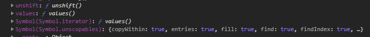

## Redux-Saga 맛보기

redux-saga는 redux-thunk와 마찬가지로 redux 미들웨어로써 redux 사용 시 비동기 요청의 side effect를 줄이기 위해서
사용된다. 지금까지 redux-thunk를 사용하거나 컴포넌트에서 비동기 요청을 직접 처리했었다.

redux-saga를 공부하고 적용해보면서 redux-thunk와는 다르게 effect를 관리하는 많은 기능들이 확실히 유연하고
좋다고 생각했다. redux-saga 문서에는 redux-saga 는 애플리케이션 부작용 (예 : 데이터 가져오기와 같은 비동기 작업 및 브라우저 캐시 액세스와 같은 불순한 작업)을 더 쉽게 관리하고, 실행하기 쉽고, 테스트하기 쉽고, 오류 처리를 더 잘하는 것을 목표로 하는 라이브러리입니다.라고 설명되어있다. 작업을 해보니 위에 설명들이 무엇을 의미하는 건지 확실히 알 수 있었다. redux-saga는 generator를 사용하여 비동기 흐름을 제어하는데 아래를 통해 더 알아보자.

## Generators 사용

redux-saga는 generator라는 ES6기능을 사용한다. generator는 기존에 함수형 프로그래밍을 조금씩 공부하면서 알고 있었는데 generator는 개발자의 요구에 따라 흐름을 제어할 수 있다. generator의 반환 값은 iterator이자 iterable인데
javascript의 Array, Set, Map은 for of 문으로 순회가 가능한 이유가 이 세 가지 모두 iterable, iterator 프로토콜을 따르기 때문이다. 구글 개발자 모드를 통해 Array를 보게 되면 아래와 같이 [Symbol.iterator] 가진 iterable이라는 걸 알 수 있다.
설명이 부족하고.. 쉽지는 않지만 **iterable은 iterator를 리턴하는 [Symbol.iterator]를 가진 값이며 iterator은 value와 done을 가진 객체를 리턴하는 next() 함수를 가진 값이다.**



그렇다면 [Symbol.iterator]를 null로 바꾼다면 for of 문이 동작하지 않을까?

```js
const arr = [1, 2, 3];
arr[Symbol.iterator] = null;

for (const item of arr) {
  console.log(item);
}

// 출력 - TypeError: arr is not iterable
```

위와 같이 iterable이 아니라고 오류가 발생한다. 따라서 Array, Set, Map은 iterable프로토콜을 따르기 때문에
for of문을 사용한 반복이 가능하다. 그렇다면 generator의 반환 값이 iterator, iterable을 따르는 객체라면 Array와 같이
반복이 돼야 한다. 간단하게 generator을 만들고 반복문을 돌려보자.

generator는 function 키워드에 \*을 붙여서 만든다. 따라서 ES6문법에 allow function으로는 생성할 수 없다.
또 안에 yield를 통해 다음 next까지 발생할 때까지 정지하게 된다. 아래를 통해 간단한 예시를 보자.

```js
function* generatorFunc() {
  yield '첫번째';
  yield '두번째';
  yield '세번째';
}

const generator = generatorFunc();

console.log(generator.next()); // 첫번째 yield 실행 후 멈춤
console.log(generator.next()); // 두번째 yield 실행 후 멈춤
console.log(generator.next()); // 세번째 yield 실행 후 멈춤
console.log(generator.next()); // 모든 yield 실행 후 done이 true로 바뀜.

/**
출력

{
  done: false,
  value: "첫번째"
}
{
  done: false,
  value: "두번째"
}
{
  done: false,
  value: "세번째"
}
{
  done: true,
  value: undefined
}

*/
```

위 결과물을 보면 yield의 결과물을 담은 value와 모든 yield의 종료 여부를 담은 done이 담긴 객체를 리턴한다.
그렇다면 gnerator는 위에 설명했듯이 next()를 가진 iterator라고 볼 수 있기에 아래와 같이 for of문을 통한 반복이 가능해진다.

```js
function* generatorFunc() {
  yield '첫번째';
  yield '두번째';
  yield '세번째';
}

const generator = generatorFunc();

for (const item of generator) {
  console.log(item);
}

/**
출력

"첫번째"
"두번째"
"세번째"
*/
```

부족하지만 generator에 대해 간단하게 알아보았다. redux-saga는 이런 generator 특성을 사용하여 비동기 흐름을 쉽게 읽고 테스트할 수 있도록 해준다.

## Redux-Saga 적용해보기

**해당 테스트 샘플은 node, vscode 등 개발환경이 갖춰진 상태에서 진행합니다.**
먼저 CRA를 통해 프로젝트를 생성해보자.

```sh
npx create-react-app redux-saga-test
```

다음 필요 없는 App.css, index.css 등 제거하여 App.js를 정리해주고 아래와 같이 redux와 redux-saga를 설치해줍니다.

```sh
npm i redux react-redux redux-saga
```

redux 미들웨어에는 비동기 처리를 위한 redux-thunk나 redux-saga를 말고도 redux-logger 등 많은 미들웨어들이
존재한다. 추후에 더 많은 미들웨어를 추가해서 테스트 해보면서 공부해보는걸 추천한다.

폴더 구조나 컴포넌트를 분리하는 건 개발자마다 다를 수 있다고 생각하기에 테스트와 같이 폴더 구조를 잡을 필요는 없다.

저는 Root.js를 만들어 App.js가 Route 역할만 담당할 수 있도록 빼는 게 습관이기에 Root.js를 만들어
redux 적용을 위한 Provider 컴포넌트를 적용시켜줬다.

src 폴더 아래 Root.js 파일을 만들고 store를 react에 적용시켜줍니다. 아직 store을 만들지 않았기 때문에
오류가 나도 일단 무시하자.

**src/Root.js**

```js
import { Provider } from 'react-redux';
import App from './components/App';
import store from './store';

const Root = () => {
  return (
    <Provider store={store}>
      <App />
    </Provider>
  );
};

export default Root;
```

생성한 Root.js를 index.js에서 App.js를 대체한다.

**src/index.js**

```js
import React from 'react';
import ReactDOM from 'react-dom';
import Root from './Root';
import reportWebVitals from './reportWebVitals';

ReactDOM.render(
  <React.StrictMode>
    <Root />
  </React.StrictMode>,
  document.getElementById('root')
);

// If you want to start measuring performance in your app, pass a function
// to log results (for example: reportWebVitals(console.log))
// or send to an analytics endpoint. Learn more: https://bit.ly/CRA-vitals
reportWebVitals();
```

꼭 Root.js를 만들어 적용할 필요 없이. index.js에 Provider를 감싸줘도 무방하다.
다음은 store을 만들어 보자.
redux에 대하여 어느 정도 지식이 있다고 생각하고 redux 자신의 개발방식에 맞게 redux를 적용하자.

이번 포스팅에서는 최상위 폴더 아래 store폴더를 만들고 store 폴더 아래 actions 폴더와 reducers 폴더를 만들고 액션과 리듀서를 나눴다.
기존엔 ducks 구조를 써 액션과 리듀서를 같은 파일에 뒀는데 redux-saga를 쓰면서 코드가 기준보다 길어져 나눴습니다.
**\*ducks 구조란 액션, 액션 생성자, 리듀서를 한 파일에 두는 것을 말합니다.**

### store 설정

먼저 액션을 정의해 보자. 테스트를 위해서 JSON 데이터를 제공해주는 http://jsonplaceholder.typicode.com/ 에서
post 데이터를 불러와 saga를 통해서 비동기 처리를 해보도록 할 것이다.

액션과 리듀서를 편하게 생성하고 관리하기 위해서 최근에 알게 된 redux toolkit을 사용해 보았다.
redux를 간편하게 사용하기 위해 문서도 아주 잘 정리되어있어 한번 읽어보는 걸 추천한다. <br />
http://redux-toolkit.js.org/tutorials/basic-tutorial

actions 폴더 아래 post.js 생성하고 액션을 정의해 준다. 비동기 처리는 요청, 성공, 실패로 나눌 수 있다.
따라서 saga에서는 REQUEST, SUCCESS, FAILURE 3가지 액션을 만들어 준다.

requestPostAction만 createAction으로 액션 생성자를 만든 이유는 컴포넌트에서 액션을 실행하기 위해서
REQUEST만 액션 생성자를 생성해줬다. action은 결국 객체이다. createAction을 사용하여 액션 함수를 안 만들어도
컴포넌트에서 dispatch 할 때 {type(액션 타입), data데이터}를 객체로 넘겨줘도 된다.

**src/store/actions/post.js**

```js
import { createAction } from '@reduxjs/toolkit';

export const LOAD_POST_REQUEST = 'LOAD_POST_REQUEST';
export const LOAD_POST_SUCCESS = 'LOAD_POST_SUCCESS';
export const LOAD_POST_FAILURE = 'LOAD_POST_FAILURE';

export const requestPostAction = createAction(LOAD_POST_REQUEST);
```

reducers 폴더 아래도 post.js 파일을 생성한 후 초기 State상태와 각 action의 처리 reducer를 정의해줍니다.
**src/store/reducers/post.js**

```js
import { createReducer } from '@reduxjs/toolkit';
import * as postActions from '../actions/post';

const initialState = {
  posts: [],
  loadPostLoading: false,
  loadPostDone: false,
  loadPostError: null,
};

const postReducer = createReducer(initialState, builder => {
  builder.addCase(postActions.LOAD_POST_REQUEST, state => {
    state.loadPostLoading = true;
    state.loadPostDone = false;
    state.loadPostError = null;
  });
  builder.addCase(postActions.LOAD_POST_SUCCESS, (state, action) => {
    state.posts = action.data;
    state.loadPostLoading = false;
    state.loadPostDone = true;
    state.loadPostError = null;
  });
  builder.addCase(postActions.LOAD_POST_FAILURE, (state, action) => {
    state.loadPostLoading = false;
    state.loadPostDone = false;
    state.loadPostError = action.error;
  });
});

export default postReducer;
```

initialState는 아시다시피 초기 state 상태를 정의하는데 Loading, Done, Error 등은 비동기 API 통신 후 상태를 저장하는 데 사용한다. 처음 redux-thunk나 redux-saga를 접했을 때 코드 양도 늘어나고 Error정도만 생성하면 되지 않을까?라는 생각이 들었는데 토이 프로젝트를 통해 redux-saga를 적용해 보면서 생각이 바뀌었다. 오류를 방지하고 컴포넌트에서
비동기 흐름을 파악하기 위해서 각 상태를 가지고 있어야 한다.

이제 post를 조회하는 리듀서를 만들었다. 추후에 user 관련 state는 따로 action과 reducer를 만들면 된다.
그럼 각각 만들어진 리듀서를 combineReducer를 사용해 합친다.

reducers폴더 아래 index.js파일을 만들고 만든 루트 리듀서를 만들어 준다.

**src/store/reducers/index.js**

```js
import { combineReducers } from 'redux';

import post from './post';

export default combineReducers({
  post,
});
```

이제 테스트하기 위한 redux 설정은 완료했다. 다음은 비동기 처리를 위한 redux-saga설정을 해보자.
store폴더 아래 만든 sagas 폴더에 post.js 파일을 생성한다. 이 파일은 post 비동기 처리를 위한 saga 설정을 넣어줍니다.
아래 posetService는 위에 설명한 https://jsonplaceholder.typicode.com에서 post데이터를 요청하는 API를 axios로 요청하는 함수이다.

**src/store/sagas/post.js**

```js
import { all, fork, takeLatest, call, put, delay } from 'redux-saga/effects';
import * as PostActions from '../actions/post';
import postService from '../../libs/axios/services/post';

/**
postService안에 loadPostAPI는 아래와 같다.
const loadPostAPI = () => {
  return axios.get('https://jsonplaceholder.typicode.com/posts');
};
*/

function* loadPost() {
  const response = yield call(postService.loadPostAPI);
  try {
    yield put({
      type: PostActions.LOAD_POST_SUCCESS,
      data: response.data,
    });
  } catch (error) {
    yield put({
      type: PostActions.LOAD_POST_FAILURE,
      error: error.response.data,
    });
  }
}

function* watchLoadPost() {
  yield takeLatest(PostActions.LOAD_POST_REQUEST, loadPost);
}

function* postSaga() {
  yield all([fork(watchLoadPost)]);
}

export default postSaga;
```

saga는 여러 effect 헬퍼 함수들을 제공한다. 아래 saga 헬퍼 함수가 정리된 블로그이다. <br />
https://sustainable-dev.tistory.com/94

위에 블로그에 설명에 조금 설명을 붙이자면 takeLatest는 요청된 모든 비동기 요청을 전부 서버로 보내지만
saga에서 마지막 요청만 적용하게 된다. 결국 서버에게는 모든 요청이 전송된다.
또 fork와 call은 함수를 실행시키는 헬퍼 함수인데 둘의 차이점은 fork는 비동기로 호출되고 call은 동기적으로 호출된다. 따라서 위 소스에서도 axios로 요청하는 http 비동기 통신은 call로 호출하는 걸 볼 수 있다.

결국 saga에서 async, await 역할을 한다고 생각하면 된다.
fork, call 모두 첫 번째 인자로는 호출되는 함수, 두번째 인자로는 호출 되는 함수의 파라미터를 넣어주면 된다.
이외 더 많은 좋은 throttle 등 더 좋은 기능들이 있으니 찾아보자.

**effect 헬퍼 함수를 사용할 땐 꼭 yield를 붙여주는 걸 잊지 말자.**

다음은 rootSaga를 만들어준다. 마찬가지로 postSaga를 all로 saga를 묶어준다. 추후에 userSaga를 만들게 되면
rootSaga에 모든 saga들을 적용해주면 된다.

sagas폴더 아래 index.js파일을 만들고 아래처럼 적용하자.
**src/store/sagas/index.js**

```js
import { all, fork } from 'redux-saga/effects';

import postSaga from './post';

function* rootSaga() {
  yield all([fork(postSaga)]);
}

export default rootSaga;
```

다음은 store를 생성하는 storeConfigure를 생성해보자.
store폴더 아래 index.js 파일을 만들고 아래와 같이 설정하자.

**src/store/index.js**

```js
import { createStore, compose, applyMiddleware } from 'redux';
import { composeWithDevTools } from 'redux-devtools-extension';
import logger from 'redux-logger';
import createSagaMiddleware from 'redux-saga';

import reducer from './reducers';
import rootSaga from './sagas';

const sagaMiddleware = createSagaMiddleware();
const middleware = [logger, sagaMiddleware];

const enhancer =
  process.env.NODE_ENV === 'development'
    ? composeWithDevTools(applyMiddleware(...middleware))
    : compose(applyMiddleware(...middleware));

const store = createStore(reducer, enhancer);
store.sagaTask = sagaMiddleware.run(rootSaga);

export default store;
```

생성한 reducers와 sagas를 묶어 export 한 두 가지 root들을 createStore를 통해 store를 생성한다.
createStore는 첫 번째 인자로 reducer를 받고 두 번째 인자로 enhancer를 받는데 enhancer는 각 생성한
미들웨어들을 compose로 묶는다. 위에는 logger와 saga 미들웨어를 적용했다.
redux-logger는 redux실행 전 후 결과를 로그로 남겨준다.
<br />
https://www.npmjs.com/package/redux-logger

이제 컴포넌트를 만들어 테스트해보자. 컴포넌트를 만들고 App.js에서 export 하여 테스트해보자.
지금까지 활용하였던 React UI 프레임워크는 2가지인데 Metarial UI와 antd 중에 antd를 사용해서 테스트 해봤다.
antd를 사용하지 않으려면 loading prop을 제외하고 html 버튼을 만들어서 테스트하면 된다.

https://ant.design/

**src/App.js**

```js
import { useDispatch, useSelector } from 'react-redux';
import { requestPostAction } from '../store/actions/post';
import PostItem from '../components/PostItem';
import { Button } from 'antd';

const TestComponent = () => {
  const dispatch = useDispatch();
  const { posts, loadPostLoading } = useSelector(state => state.post);

  const onPostSearchClick = useCallback(() => {
    dispatch(requestPostAction());
  }, []);

  return (
    <>
      <h1>SamplePage</h1>
      {/** loading = loadPostLoading이 false가 될 때까지 로딩표출 */}
      <Button loading={loadPostLoading} onClick={onPostSearchClick}>
        게시글 불러오기
      </Button>
      {posts.map(post => (
        <PostItem post={post} />
      ))}
    </>
  );
};

export default TestComponent;
```

실행 흐름을 간단하게 살펴보면 useDispatch hook을 사용해서 위에서 생성해둔 requestPostAction을 통해
액션을 실행하게 되면 reducer에서 REQUEST를 실행하고 saga에서 대기 중인 watchLoadPost를 실행하면서 takaLatest로 정의했던 loadPost에서 해당 비동기 요청을 처리하여 각 http response 결과물에 따라
LOAD_POST_SUCCESS 또는 LOAD_POST_FAILURE를 put을 통해 dispatch 한다.

직접 구현해보고 디버깅하며 흐름을 이해하는 것이 중요하다고 생각한다. redux-thunk와 redux-saga와 비교했을 때
redux-saga가 더 많은 기능을 제공한다고 생각이 든다. 다음 토이 프로젝트를 진행하면 redux-saga를 사용하여
프로젝트를 구성하여 보려 한다.

참고 - zerocho님의 온라인 강의
