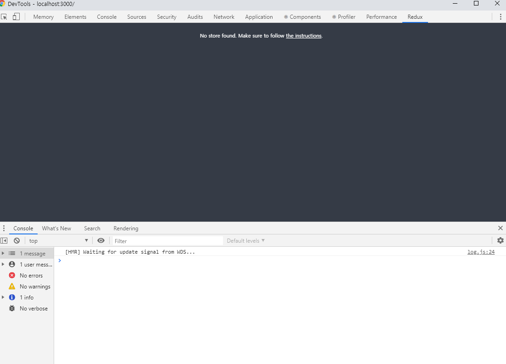

## React redux devTools 개발자 도구 사용
redux 개발 시 디버깅에 유용한 툴로 스토어의 상태나 어떤 액션들이 디스패치 되었는지 알 수 있어 유용한 툴이다.
redux는 React에만 국한된 모듈은 아니지만 React 셋팅 환경으로 설명했다.


### 설치방법
1. 크롬 웹 스토어에 접속한다.
[https://chrome.google.com/webstore/category/extensions](https://chrome.google.com/webstore/category/extensions)

<br />

2. Redux DevTools 검색한다.

<br />

3. 설치 후 크롬 개발자 도구를 열어 Redux 탭을 확인한다. (바로 생성되지 않을 경우 프로젝트 재실행)

<br />

4. 설치 후엔 스토어와 연계가 안되어 아래와 같은 문구가 표출되며 제대로 작동하지 않을것이다.


<br />

5. 마지막으로 프로젝트 스토어 생성 부분에 툴을 인식 할 수 있도록 아래 소스를 추가한다.
```js
const store = createStore(reducers, window.devToolsExtension && window.devToolsExtension());
```