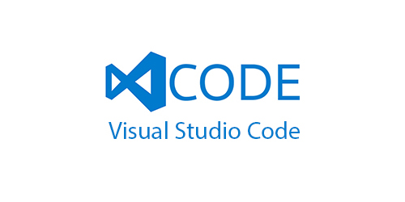
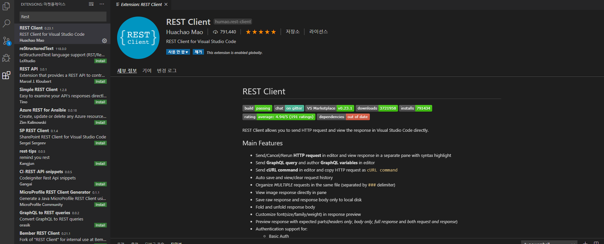
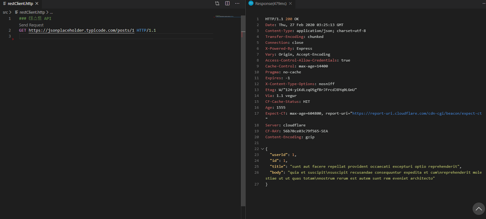

## VSCode Rest Clinet Extension 사용
Visual Studio Code로 개발을 진행하면서 편리한 Extension을 찾다가 Postman을 대체하여 API 테스트나 간단한 문서 정리에 참고하기 좋은 Extension을 발견하여 소개하는 글을 작성한다.

### Rest Client 설명 참고
아래는 Rest Client를 사용하면서 참고할 수 있는 Marketplace다.
(Rest Client 설명 참고)[https://marketplace.visualstudio.com/items?itemName=humao.rest-client]

### 설치 및 기본 셋팅
1. 아래와 같이 VSCode Marketplace를 사용하여 Rest Client를 설치하여 준다.



2. 해당 프로젝트나 자신의 작업공간에 .http / .rest 확장자로 파일을 생성하여 준다.

3. `###`을 이용하여 해당 테스트 API에 대한 정보나 요청정보를 써주면 SendRequest라는 텍스트가 생긴다.
아래와 같이 테스트 API를 작성하고 Send Request를 클릭하면 분할 창이 나오면서 API에 대한
Response 정보가 나타나게 된다.

```js
### Test API
Send Request <-- 자동생성
GET https://jsonplaceholder.typicode.com/posts/1 HTTP/1.1
```



### 기본 사용 문법

```js
// restClient.http 파일

### GET 사용
Send Request <-- 자동생성
GET https://example.com/topics/1 HTTP/1.1

### POST 사용
Send Request <-- 자동생성
POST https://example.com/comments HTTP/1.1
content-type: application/json <!-- 헤더설정

{
    "name": "sample",
    "time": "Wed, 21 Oct 2015 18:27:50 GMT"
}

### 쿼리스트링 사용
Send Request <-- 자동생성
GET https://example.com/comments?page=2&pageSize=10
```
**! 이외에도 많은 기능을 제공 함으로 위에 게시 된 링크를 통하여 참고**

